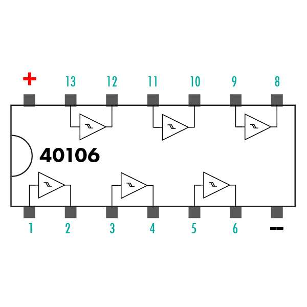
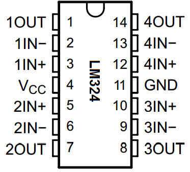

# sesion-10b

viernes 22 de mayo

## investigación

en el sintetizador estabamos utilizando el chip 4017 para el oscilador, ahora veremos otras opciones de chips para poder crear otro tipo de sonidos y experimentar tipos de ondas.

no pude asistir a la clase pero me puse a investigar sobre los chips que estuvo viendo mi grupo

VCO: oscilador controlado por voltaje.

### chip CD40106
este chip es de tipo "hex schmitt trigger inverter", que tiene 6 compuertas lógicas NOT y son independientes, es decir que invierte (opuesto) lo que sea que le entreguemos, solo entiende encendido absoluto o apagado absoluto.

| input | output |
| :--- | :--- |
| 1 (HIGH / VCC) | 0 (LOW / GND) |
| 0 (LOW / GND) | 1 (HIGH / VCC) |

para poder llevarlo a un oscilador y que podamos modificar el sonido hay que hacer una red RC que es una resistencia y un condensador en un ciclo donde el condensador descarga la energía almacenada a través de la resistencia;

cuando se llena, la entrada del chip detecta un HIGH y cambia su salida a LOW, al pasar a LOW el condensador empieza a descargarse.
cuando se descarga, la entrada detecta un LOW y la salida vuelve a pasar a HIGH.

estos saltos bruscos de voltaje generan una onda cuadrada, la onda no suena suave, sino que produce un zumbido eléctrico muy crudo, agresivo y metálico

| pin | conexión |
| :---: | :--- |
| 1 | 1 IN (compuerta 1) |
| 2 | 1 OUT (compuerta 1) |
| 3 | 2 IN (compuerta 2) |
| 4 | 2 OUT (compuerta 2) |
| 5 | 3 IN (compuerta 3) |
| 6 | 3 OUT (compuerta 3) |
| 7 | GND |
| 8 | 4 IN (compuerta 4) |
| 9 | 4 OUT (compuerta 4) |
| 10 | 5 IN (compuerta 5) |
| 11 | 5 OUT (compuerta 5) |
| 12 | 6 IN (compuerta 6) |
| 13 | 6 OUT (compuerta 6) |
| 14 | VCC |

### chip LM324

este chip es de tipo "quad operational amplifier", que tiene 4 amplificadores operacionales y son independientes, es decir que compara 2 voltajes de entrada en cada sección y cambia el estado de su salida dependiendo de cuál entrada sea mayor.

cada sección del LM324 es un amplificador operacional, el chip compara constantemente sus dos entradas para decidir el estado de su salida.

entrada (+): no inversora

entrada (-): inversora

| comparación del voltaje | OUTPUT | 
| :--- | :---: |
| entrada (+) es mayor que entrada (-) | HIGH |
| entrada (-) es mayor que entrada (+) | LOW |

### explicación funcionamiento con una compuerta (pines 1, 2 y 3)

- momento de carga (salida en HIGH): la salida (pin 1) entrega 9V, fijando esa meta con un valor alto en la entrada (+) como el condensador (pin 2) está vacío (en 0V), la entrada (+) gana y mantiene la salida encendida. El voltaje fluye por la resistencia y comienza a cargar el condensador.
- en el momento en que el condensador se llena y supera el valor anterior, la entrada inversora (-) gana por voltaje.
- momento de descarga (salida en LOW): al ganar la entrada (-), la salida cae inmediatamente a 0V y la meta de la entrada (+) baja. Al estar la salida en 0V, el condensador comienza a descargarse través de la resistencia.
- en cuanto el condensador se descarga y da un valor por debajo de la nueva meta, la entrada (+) vuelve a ganar lo que hace que la salida regresa a 9V y el ciclo se repita infinitamente.

#### tipos de ondas obtenidas

- en la salida (pin 1): los cambios instantáneos entre 9V y 0V trazan una onda cuadrada.
- en el condensador (pin 2): el viaje diagonal de la carga y descarga constante trazan una onda triangular (el sonido deberia ser suave y más puro).

