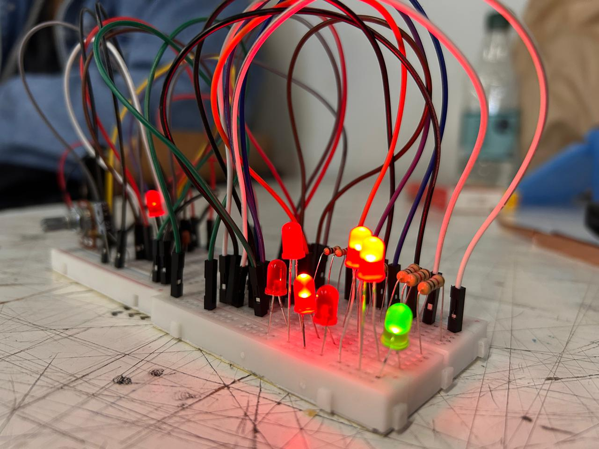

# sesion-10b

Clase 22 de mayo

## ** TRABAJO EN CLASES PROYECTO 02**

| Paso | Proceso |
|------|----------|
| 1 | Partimos viendo las dudas que teníamos sobre el chip 4040. |
| 2 | Empezamos a evaluar si quedarnos con el CD4040 o el CD4017, o si teníamos alguna otra propuesta de chip CD. También nos planteamos la opción de hacer un circuito sin chip. |
| 3 | Se realiza el circuito con el CD555 en el protoboard para empezar a probar los circuitos. Primera falla: pin 6 y 2 no estaban conectados|
| 4 | Se realiza el esquemático en KiCad del CD4040. |
| 5 | Haremos una prueba del CD4040 de 4 pasos. NO ESTABA CONECTADO A GND |
| 6 | Se conecta el CD 555 y CD4040 y el 4040 falla, no prende las led |
| 7 | Logramos que el circuito funcionara el CD4040 oscila correctamente |
| 8 | Prueba del CD4040 integrarles mas leds |
| 9 | Se hizo una prueba con 7 leds, pero el ultimo led no prendia-Hipotesis: Led quemado-Mala conexion de algun cable/ En definitiva estaba quemado el led, se arreglo el problema cambiando el led obviamente |
| 10| Haremos un mix CD386 para probar como suena con el CD4040/ no funciono/Se evalua posibles fallas. -Habia un cable que no estaba conectado a nada  -Se cambio 3 veces de chip y ninguno funciionaba( no sabemos si eran los chips o era por otra cosa) -Se evalua la posibilidad  de que el parlante este bueno|
| 11| Desarmamos el CD4040 y el CD386 para hacerlo denuevo y ver que esta fallando |

https://proveedoracano.com/blog/transistor-2n2222_012/

http://hyperphysics.phy-astr.gsu.edu/hbasees/Solids/trans.html

## **Finalizacion de la clase**

- Carpeta: Proyecto 02- empezar a escribir nuestro proceso en la carpeta

- tenemos que hacer dos alternativas/ modulos- va a ser un ecosistema que se hace cargo de un tema

- traer: esquematicos,PCB, Lista de materiales

- IMPORTANTE:no subir videos a **proyecto 02** si se permite subir Gifs

- Subir links de youtube

- Subir imagenes

- kicad- NO subir carpeta comprimida (ZIP NO SE SUBE)

- Nombre del archivo: 3 palabras en minusculas
  
  ↳nombre-alternativa-version(EJ:V.01)
  
## **ORGANIZACION GRUPAL**

Isidora: Transcribir la informacion a la carpeta del **PROYECTO 02**, y de la documentacion del proceso

Dayana: Buscar informacion sobre transistores y 2 opcion de chip

Camila: Buscar informacion sobre transistores y 2 opcion de chip

Angel: Se encargara de hacer la PCB en kicad

Tomas: Buscar informacion sobre transistores y 2 opcion de chip

## **ENTREGA MARTES 26 DE MAYO**

1°- 1  o 2 opciones/ideas de chips para la segunda opcion 

2°- Esquematico ✓

   ↳PCB
  
3° Buscar mas informacion sobre como incorporar transistores

4° Transcribir avance de hoy 22 de mayo

## **ENCARGO**

Investigar que es una fenomenologia:

SEGUN LA RAE:

f. Fil. Teoría de los fenómenos o de lo que aparece.

f. Fil. En Friedrich Hegel, filósofo alemán de comienzos del siglo XIX, dialéctica interna del espíritu que desde el conocimiento sensible a través de las distintas formas de consciencia llega hasta el saber absoluto.

f. Fil. Método desarrollado por Edmund Husserl que, partiendo de la descripción de las entidades y cosas presentes a la intuición intelectual, logra captar la esencia pura de dichas entidades, trascendente a la misma consciencia.

https://dle.rae.es/fenomenolog%C3%ADa

Lo que yo entiendo es que:

Es el estudio de las cosas, como las vivimos o las experimentamos, una manera de entenderlo e como la lluvia es agua cayendo por la condensacion, te daria la temperatura exacta y cuantos milímetros cayeron, son datos objetivos. Es lo que tu sientes cuando te mojas, es la sensacion de frio en la piel, el olor a tierra mojada que te pone nostalgico o el sonido ritmico contra el paraguas.

En resumen, la fenomenologia no busca la ciencia exacta de la lluvia, busca describir como es para ti vivir la experiencia de estar bajo ella, busca poner la vivencia personal como foco.

## **TEXTO: HACIA UNA FILOSOFIA DE LA FILOSOFIA**

Cap.6 La distribucion de la fotografia: 

Lo que entendi en este capitulo es que el fotografo pierde el poder de decidir o de tener su propia voz frente a los medios, por que a final la prensa o los canales de publicidad deciden que significado tendrsa este. Para que ellos te tomen en consideracion y eligan tu trabajo, tienes que seguir sus reglas, así que terminas trabajando para el sistema. Y al final, somos como una camara que tenemos que aceptar la información ya programada sin pensar demasiado por nuestra cuenta.

Cap.7 La recepcion de la fotografia: 

Este capítulo basicamente describe como personas que viven en modo piloto automatico, ya ni nos detenemos a pensar qué es lo que hay detras de una foto, ver su verdadera intencion que era lo que e artista queria trasmitir, solo la consumimos rapido, como si fuera la realidad y no algo armado por una maquina. Me hizo sentir que estamos perdiendo nuestra libertad de opinion porque nos acostumbramos a que las imágenes nos digan que pensar y como actuar, nos olvidamos de mirar el mundo con nuestros propios ojos y usar el sentido crítico.
