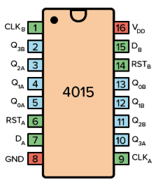
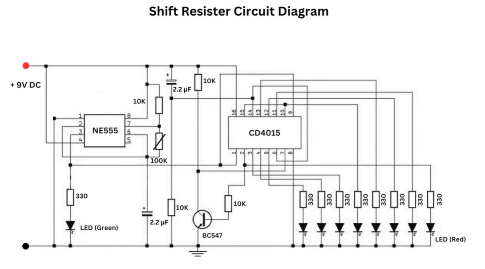

# sesion-11a

**Clase 26 de mayo**

## **TRABAJO EN CLASES**

| paso | Proceso |
|--------|---------|
| 1 | Vamos a decidir el 2do circuito, estamos entre el CD4017 y el CD4015 |
| 2 | Haremos pruebas con el Cd4015(santi fue a comprar los chips, y le encargamos cd4040 y cd4015) mientras tanto segimos investigando |
| 3 | Vamos a trabajar en base al esquematico01 y haremos pruebas en protoboard y en falstad |
| 4 | haremos pruebas despues de clases cuando tengamos los materiales que necesitamos |

**Investigacion**

CD4015:
2 registros de desplazamiento independientes de 4 bits
Permite controlar hasta 8 LEDs o componentes

https://www.youtube.com/watch?v=UFtW6kHt54g

Aca estan trabajando con un circuito secuencial de Leds que genera un efecto de desplazamiento, la señal va pasando de una salida y hace que los LEDs se enciendan en orden, 8 tiempos

| Tiempo | LED1 | LED2 | LED3 | LED4 | LED5 | LED6 | LED7 | LED8 |
|---------|------|------|------|------|------|------|------|------|
| 1 | 1 | 0 | 0 | 0 | 0 | 0 | 0 | 0 |
| 2 | 0 | 1 | 0 | 0 | 0 | 0 | 0 | 0 |
| 3 | 0 | 0 | 1 | 0 | 0 | 0 | 0 | 0 |
| 4 | 0 | 0 | 0 | 1 | 0 | 0 | 0 | 0 |
| 5 | 0 | 0 | 0 | 0 | 1 | 0 | 0 | 0 |
| 6 | 0 | 0 | 0 | 0 | 0 | 1 | 0 | 0 |
| 7 | 0 | 0 | 0 | 0 | 0 | 0 | 1 | 0 |
| 8 | 0 | 0 | 0 | 0 | 0 | 0 | 0 | 1 |

https://youtu.be/jHPMg0YVU5w?si=OjHoX2zdzOFOeVCw

Genera un efecto donde los LEDs se encienden uno tras otro mediante un desplazamiento de datos.

| Tiempo | LED1 | LED2 | LED3 | LED4 | LED5 | LED6 | LED7 | LED8 |
|---------|------|------|------|------|------|------|------|------|
| 1 | 1 | 0 | 0 | 0 | 0 | 0 | 0 | 0 |
| 2 | 0 | 1 | 0 | 0 | 0 | 0 | 0 | 0 |
| 3 | 0 | 0 | 1 | 0 | 0 | 0 | 0 | 0 |
| 4 | 0 | 0 | 0 | 1 | 0 | 0 | 0 | 0 |
| 5 | 0 | 0 | 0 | 0 | 1 | 0 | 0 | 0 |
| 6 | 0 | 0 | 0 | 0 | 0 | 1 | 0 | 0 |
| 7 | 0 | 0 | 0 | 0 | 0 | 0 | 1 | 0 |
| 8 | 0 | 0 | 0 | 0 | 0 | 0 | 0 | 1 |

## **Misaa-Estandares**

eurorack
todos tienen las mismas entradas y salidads para conectarse
cada grupo tendra dos jacks

**tamaño placa max 10x10cm**

- probar el 4015 en la protoboard
- documentacion 4040
- Subir proyecto-esquematico-pcb
- documentacion 4015
- esquematico-pcb 4015

**Colaboracion con otro grupo-Santi Cifuentes del grupo 04 nos compro chips**
  
## **organizacion grupal**

- probar el 4015 en la protoboard
- documentacion 4040
- Subir proyecto-esquematico-pcb
- documentacion 4015
- esquematico-pcb 4015
  
**separacion por persona**
  
- isi: compra de componentes

- cami: documentacion 4040 lo que tenemos hasta ahora

- daya: esquematico 

- angel:  documentacion 4015

- tomas: protoboard 4015-falstad

**PROYECTO**

Otros circuitos

Usamos el cd555 para probar los secuenciadores en este caso el cd4040

