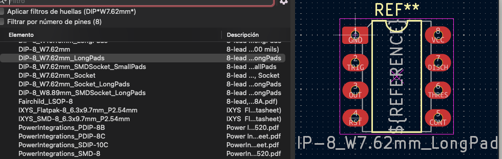
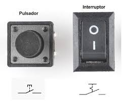

# sesion-09b

Esta clase sirvió para poder resolver dudas que no hayamos tenido después de construir las PCB en el Kicad.

Aprendimos que cuando estamos añadiendo las huellas en el esquemático, específicamente en los chips, se buscan como dip. Dip es el número de patitas que tiene el chip, el dip de 7.62 mm de ancho es el más común de todos. Aunque siempre es mejor ocupar los que salen long path, ya que estos son más fáciles de soldar porque tienen las patas más anchas.

También una duda que a mi parecer todos tuvimos porque cuando Misa mandaba sus esquemáticos los elementos tenían los símbolos en distinto orden a los que vienen predeterminados en Kicad. Para poder editarlos hay que seleccionar el elemento y apretar la tecla E, después seleccionar editar elementos, pero nunca apretar editar elemento de biblioteca, siempre crear una biblioteca propia y ahí guardar los elementos editados.

Y por último la pregunta que más me interesaba responder ya que la hice yo era sobre los botones. Como dijo Aarón, los botones son un mundo.

Existen los botones switch y los push buttons. Los push buttons son botones que necesitan si o si que algo los mantenga funcionando, es decir, que mientras yo presione el botón el circuito estará en funcionamiento pero cuando saque el dedo, este parara. Pueden venir abiertos o cerrados.

En cambio los switch puedes prenderlos, irme y se va a mantener encendido hasta que alguien vuelva a presionar.

Y una diferencia del vocabulario, el interruptor como dice su nombre, interrumpe el estado. Esto significa que el interruptor es el switch. En cambio los botón o pulsador solo funcionan o interrumpen la señal cuando alguien o algo los presiona, cuando este deja de ser pulsado, vuelve a su estado original solo.

LIBROS IMPORTANTES

electronic music from scratch

<https://hackaday.com/2015/04/10/logic-noise-more-cmos-cowbell/>

## Lectura Cap 2 y 3

En el capitulo 2 parte hablando de  que las imágenes técnicas son hechas por aparatos que a su vez, estos aparatos fueron creados por textos científicos y comienza a hacer una comparación entre imágenes tradicionales, las cuales llama prehistóricas y de primer grado porque se hacen a partir del mundo concreto y las imágenes técnicas que llama post-históricas y de tercer grado porque pasan por los textos que están hechos a partir de imágenes que abstraen el mundo concreto.

Siento que las imágenes técnicas siguen siendo igual de mágicas que las antiguas, aunque tengan contextos distintos, no siento que pierda ese poder que tenían las imágenes antiguas. Claramente son muy distintas unas de otras pero con las imágenes técnicas se pueden llegar a cosas igual o más mágicas que las imágenes tradicionales y viceversa.

En lo que sí estoy de acuerdo en en este capítulo es que vivimos en una cultura en que todo tiene que ser fotografiado y deja de ser único, como dije en la sesión anterior, las redes sociales actuales se basan en documentar todo, lo cual deja que algunas cosas dejen de ser únicas

Y el capítulo 3 habla de los aparatos y el cómo se diferencian de las máquinas y herramientas diciendo que estas últimas transforman la naturaleza directamente mediante el trabajo y el aparato trabaja con símbolos e información. Es interesante como dice que hay una dependencia mutua entre el aparato y el humano, tomando de ejemplo la cámara ya que la persona juega con las configuraciones que viene con la cámara, pero tiene que ser con los que la cámara ya trae de serie, creando nuevas imágenes, modificando el mundo. Esto último es verdad, nosotros modificamos el mundo con estos aparatos, pero no los cambiamos.

Me llama la atención cuando habla de que los aparatos simulan el proceso de pensar del humano y podría llegar a estar de acuerdo, ya que los aparatos tienen un comportamiento propio y diferente entre distintos aparatos, al igual que el humano, también una forma de combinar símbolos, como también lo hacemos nosotros.

Será que también nosotros los humanos seamos aparatos, pero de la sociedad?
