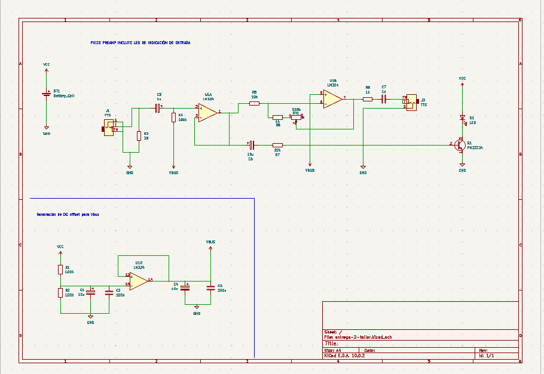

# sesion-10b

En esta clase trabajos haciendo los esquemáticos y las pcbs de nuestros respectivos piezos, le preguntamos a Misa como podíamos hacer un piezo que al activarlo este loopeara los osciladores, nos enseñó cómo y comenzamos a trabajar en los esquemáticos.

Mi aporte en esta clase de trabajo grupal fue trabajar junto a Anays en la construcción del esquemático Hybrida, quitando algunas partes y manteniendo las que nos sirven.

## Fusser cap 6 y 7

falta rellenar
