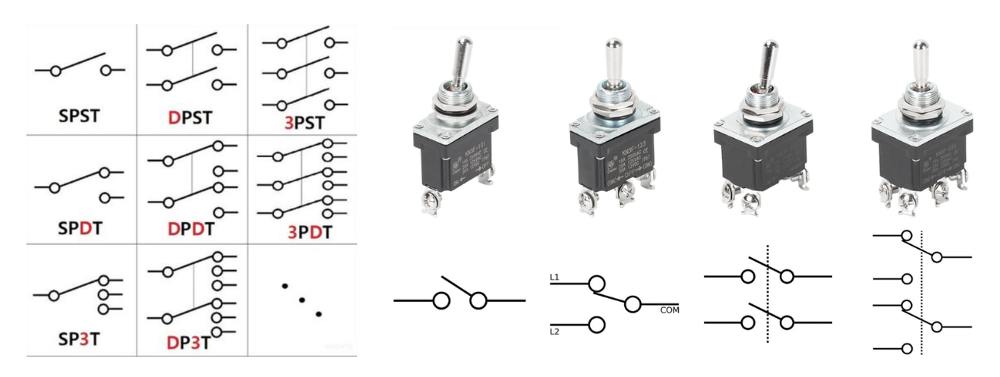

# sesion-09b

Viernes 15 de Mayo, 2026.

Nota del día:  hola  ʕ•́ᴥ•̀ʔっ  

## Referentes (y otras cosas)

- **Tega Brain** es una artista, investigadora y profesora adjunta de Tecnología Digital en la Universidad de Nueva York (NYU). Su trabajo explora la intersección de la ecología, los sistemas de datos y la inteligencia artificial, creando obras de arte que cuestionan las tecnologías digitales y su impacto ambiental.
- **Carolina Pino** es una artista visual, diseñadora y académica chilena, pionera en el país en la integración de arte, tecnología y comunidad. Es fundadora del Centro de Interfaces Emergentes en la Universidad Adolfo Ibáñez, donde se desempeña como docente, enfocándose en proyectos de hardware abierto, robótica y diseño de interacción con impacto social.
- **Sergio Majluf** es un diseñador, consultor y académico chileno especializado en diseño de información, visualización de datos y tecnologías interactivas. Ha ejercido una destacada labor docente y de gestión en instituciones como la Universidad del Desarrollo (UDD) y en la UDP, impulsando la innovación metodológica y el pensamiento de diseño en entornos digitales.
- **Martin Leiva Valdenegro** es un ingeniero, programador y docente chileno especializado en computación física, desarrollo web y nuevas tecnologías. Se desenvuelve en el ámbito académico dictando talleres y cursos universitarios enfocados en la enseñanza de la programación y el uso de herramientas digitales creativas para estudiantes de diseño y arte.
- **Sergio Mora** es un diseñador de interacción, desarrollador y académico chileno enfocado en la computación creativa y los sistemas interactivos. Trabaja en la docencia universitaria guiando proyectos que vinculan el código, los circuitos electrónicos y la experiencia de usuario (UX).
- **Manuel Córdova** es un diseñador, tecnólogo y docente chileno experto en manufactura digital, diseño asistido por computadora (CAD) y prototipado rápido. Ha estado vinculado a laboratorios de fabricación digital (Fab Labs) en Chile, facilitando la alfabetización tecnológica y el aprendizaje práctico.
- **Claudio Ruiz** es un abogado, activista y docente chileno, reconocido internacionalmente por su labor en derechos digitales, propiedad intelectual y cultura libre. Fue fundador y director de la ONG Derechos Digitales y se desempeña como consultor y profesor de políticas públicas y tecnología en diversas plataformas y universidades.
- **Berkman Klein Center for Internet & Society** (centro de investigación) fundado en la Universidad de Harvard, es uno de los centros de investigación sobre internet más importantes del mundo. Se dedica a estudiar el desarrollo, las dinámicas y el impacto de las tecnologías digitales y el ciberespacio en la sociedad, el derecho y la política. - <https://es.wikipedia.org/wiki/Berkman_Klein_Center_for_Internet_%26_Society>
- **Sfpc.study** (plataforma / escuela) de la *School for Poetic Computation* (Escuela de Computación Poética), un espacio educativo independiente y colectivo fundado en Nueva York. Ofrece cursos y residencias que exploran el código, el hardware, la teoría crítica y el activismo, promoviendo un enfoque donde la tecnología se aborda de manera artística y comunitaria. - <https://sfpc.study/>

## Qué aprendí hoy

clase de hoy: <https://youtu.be/3BaA_bFq_ww>

**Dual In-line Package** (DIP) es un tipo de encapsulado de componentes electrónicos (como circuitos integrados, microchips o bancos de interruptores) que se caracteriza por tener una forma rectangular y dos filas paralelas de pines metálicos que apuntan hacia abajo. Estos pines están diseñados para montarse mediante la tecnología Through-Hole (tecnología de orificios pasantes), ya sea soldándose directamente en una placa de circuito impreso (PCB) o insertándose en un zócalo, lo que facilita enormemente su reemplazo y su uso en placas de prueba (protoboards).

**SOIC** (Small Outline Integrated Circuit) es un tipo de encapsulado para circuitos integrados de montaje superficial (SMD/SMT) que se caracteriza por una distribución de componentes más planos y un tamaño significativamente más reducido en comparación con un DIP equivalente. Sus pines sobresalen de los lados largos del chip en forma de "ala de gaviota" (gull-wing) y se sueldan directamente sobre las pistas de la superficie de la placa de circuito, lo que permite ahorrar hasta un 30% o 50% de espacio de almacenamiento y grosor en el diseño de hardware moderno.

### Repaso Kicad + dudas

Cómo cambiar la posición de las patitas de los chips (En la Placa / PCB):
   
- **Cambiar huella o ajuste de huella del chip ("footprint"):** Permite utilizar otro formato físico del mismo chip (por ejemplo, cambiar el estándar de patas largas DIP por un formato de montaje superficial más plano como SOIC).
- **Actualizar la PCB:** Si se cambia el tipo de chip o su huella en el esquemático, estos cambios no se aplican solos. Es necesario editar la placa después presionando la tecla `F8` (o yendo a *Herramientas - Actualizar placa desde esquemático*) para que la PCB se actualice con los nuevos cambios.

Cambiar patitas en el Esquemático (SCH):
   
- **Modificar símbolos:** Al editar un símbolo se puede alterar todo lo visual del chip en el plano: la forma, la distribución de las patitas, el nombre, el texto y los números de los pines. (Nota: esto solo cambia el dibujo en el plano para facilitar el cableado, no altera el chip físico real).
- **Editar gráficamente (Colores, relleno y pines):** Si presionas la tecla `E` sobre el chip en el esquemático, abres *Editar Símbolo* (para cambiar campos de texto, valores o asignar huellas). Para editar el dibujo, los colores o la posición de los pines, debes presionar `Ctrl + E` sobre el componente (o clic derecho - *Editar con el editor de símbolos*). Esto abre el editor gráfico; una vez hechas las modificaciones, guardas y los cambios se aplicarán en tu esquemático.

Guardar la configuración de forma permanente (Crear Librerías):

Para que las modificaciones de un chip queden guardadas para siempre y puedas usarlas en cualquier otro proyecto futuro, es necesario crear una biblioteca propia siguiendo estos pasos:

1. Abrir el **Editor de Símbolos** de KiCad.
2. Ir a **Archivo - Nueva biblioteca**.
3. Seleccionar la opción **Global** (para que esté disponible en todos tus proyectos) y guardarla en tu carpeta de librerías personales.
4. Buscar el chip original en las librerías por defecto de KiCad, seleccionarlo y copiarlo (`Ctrl + C`).
5. Ir a tu nueva librería personal, hacer clic derecho y pegarlo (`Ctrl + V`).
6. Ahora puedes editar este símbolo clonado libremente, guardar los cambios y quedará registrado para siempre en tu entorno de KiCad.

#### Comandos (nuevos o que no anote antes)

- **F** de fit, que calce un componente con otra parte.
- **CTRL + S** guardado; recordar apretarlo constantemente!!

#### Glosario KiCAD (hecho por misaa)

- **CAD/CAM**: *Computer-Aided Design*. Nomenclatura para softwares de dibujo vectorial.
- **Circuito**: Red eléctrónica que tiene (al menos) una trayectoria cerrada.
- **Conector**: Dispositivo para acoplar circuitos.
- **Datasheet**: Hoja de datos, documento descriptivo y conciso de funcionamiento y dimensiones de un componente electrónico.
- **DIP**: *Double-In-Line Package*. encapsulado!! de circuitos integrados de doble fila.
- **Footprint**: *Huella*. Dibujo del espacio y conexiones utilizadas por un componente electrónico.
- **Gerber**: Formato de archivo con información necesaria para la fabricación de PCB, archivo final que se envía a los fabricantes para la producción.
- **Grid**: Grilla, guía de líneas horizontales y verticales para la ubicación de componentes electrónicos.
- **Hierarchy Sheets**: *Hojas jerárquicas*. Dibujar esquema en varias hojas.
- **DRC**: *Design Rule Checking*. Verificación espacial de los componentes, las más básicas son ancho, espaciamiento y *enclosure*.
- **Drill**: *Taladro*. Tamaño del agujero para componentes thru-hole.
- **Ground Plane**: Capa completa utilizada como ground.
- **Ground Zone**: Zona vasta de la capa utilizada como ground.
- **Header**: Conector eléctrico, de una o más filas espaciadas por 2.54 mm (0.1”).
- **IC**: *Circuito integrado*. Alta cantidad de componentes encapsulados en una pequeña pieza.
- **Layer**: Capa de una PCB.
- **Library**: Biblioteca de componentes, donde se almacenan los dibujos de los símbolos y huellas.
- **mil**: milésima parte de una pulgada, 0.0254 mm.
- **PCB**: *Printed Circuit Board*. Placa de circuito impreso, puede ser encargada y serializada en una fábrica o hecha a mano.
- **Package**: *Encapsulado.* Contenedor de componentes electrónicos. Forma física de los elementos.
- **Pad**: Porción de metal expuesto donde va soldado el componente.
- **Placa perforada**: Placa de baquelita con agujeros rodeados de cobre, para prototipar. Requiere soldado. Existen las *perfboard* y las *stripboard*, entre otras.
- **Protoboard**: Tablero perforado con agujeros interconectados entre si, para prototipar y probar componentes. No requiere soldado.
- **Schematic**. *Esquemático.* Representación gráfica de un circuito eléctrico.
- **Silkscreen**: *Capa de serigrafía*. Para dejar textos, dibujos y referencias en la placa.
- **SMT/SMD**: *Surface Mount Technology/Surface Mount Device*. Tecnología de encapsulado de componentes cuyos componentes van sobre la superficie, no requiriendo perforación.
- **SOIC**: *Small Outline Integrated Circuit*. Análogo al DIP en SMD, existen variados estándar de tamaño, y hasta de cuatro líneas (Quad-in-Line)
- **Solder Mask**: Capa protectora de la PCB, protege térmica y mecánicamente las pistas de cobre del circuito, y contiene a la soldadura de esparcirse. Aguanta temperaturas mayores a las que genera el cautín, la mayoría de las veces.
- **Symbols**: *Símbolos*. Dibujos de componentes utilizados en Eeschema, o el diseño del esquemático. A cada símbolo le corresponde posteriormente una *Huella*.
- **THT /Through(*thru)*-Hole-Technology**: *Tecnología de agujeros pasantes*. Componentes con extremos de metal, los cuales traspasan la placa a través de un agujero y son soldados por el otro lado.
- **Via**: Conexión eléctrica entre capas de la PCB.
- **Wire:** *Cable*. En diseño de circuitos, se entiende como una conexión entre componentes al dibujar un esquemático.

### Sobre botones e interruptores

#### Pulsadores (Pushbuttons / Temporales / Timbres)

Son componentes de control que **solo cambian su estado mientras se ejerce presión sobre ellos**. Al soltar el botón, vuelven automáticamente a su posición original gracias a un resorte interno.

- **Pulsadores (Pushbuttons):** Término general para los botones que se presionan.
- **Temporales:** Hace referencia a que su activación es momentánea (no retentiva).
- **Timbres:** Es el ejemplo de aplicación casera más común de un pulsador momentáneo.

Tipos de contacto interno:

- **NO (Normally Open / Normalmente Abierto):** Es el estándar para la mayoría de los pulsadores. El circuito está interrumpido (abierto) por defecto; al presionar el botón, los contactos se unen y la corriente fluye. *(Nota: En español a veces se confunde "no-abierto" como una negación, pero técnicamente significa "Normalmente Abierto").*
- **NC (Normally Closed / Normalmente Cerrado):** El circuito está unido (conectado) por defecto; la corriente fluye continuamente hasta que presionas el botón, momento en el cual el circuito se abre y se interrumpe la señal.

#### Interruptores (Switches / Palanca)

A diferencia de los pulsadores, estos componentes **tienen retención**. Cuando los activas, cambian de estado y se quedan fijos en esa posición hasta que alguien los vuelve a mover manualmente.

- **Interruptores (Switches):** Término general para los componentes que abren o cierran un circuito de forma permanente.
- **Palanca (Toggle Switch):** Tipo específico de interruptor que utiliza una palanca mecánica que se mueve de un lado a otro para cambiar la conexión (como los interruptores clásicos de avión o de algunas fuentes de poder).

## Sobre Proyecto 02 

Grupo de trabajo: N°6 

- Catalina Catalán.
- Martina Echavarría.
- Nicolás Miranda.
- Vania paredes.
- Carla Pino. 

Tema a desarrollar: Percutores. 

Ayuda profes (primer vistazo): Investigar sobre Moritz Klein y Circuitos que componen el TR-808.

## Encargo-09b 

Leer capítulo 2 y 3 del libro Hacia una filosofía de la fotografía, de Vilém Flusser, compartir apuntes y reflexiones críticas sobre el texto, prohibido usar inteligencia artificial, no sirve para este ejercicio.

### Desarrollo

