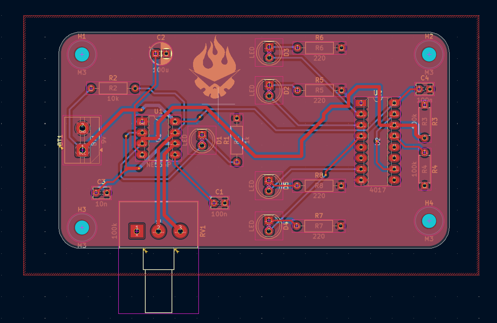

# sesion-09a

Martes 12 de Mayo

## Apuntes

* Al inicio de la clase repasamos lo básico de KiCad, es decir, los 3 pasos iniciales y cómo se utiliza.  
* Por ahora haremos los siguientes pasos:  
  4) Definir tamaños de las pistas  
  5) Repartir componentes  
  6) Rutear componentes  

---

### Pasos

#### **Definir tamaños de las pistas**

Para definir el tamaño de las pistas es necesario estar en la pestaña del **Editor de placas**.  

En la barra de herramientas superior aparece una sección llamada **"Pista:"**. Al presionarla, se abrirá una pequeña ventana donde debemos seleccionar **editar tamaños predefinidos**.  

Esto abrirá una nueva ventana en la cual debemos agregar las siguientes dos configuraciones recomendadas por el profesor, para evitar problemas en la fabricación de la placa:

* **Pista de 0,400 mm:** se usa para señales o componentes que no requieren mucha corriente.  
* **Pista de 0,800 mm:** se usa para componentes que requieren mayor corriente.  

---

#### **Repartir componentes**

Misa, al final de la clase, sugirió agregar unos hoyos en cada esquina de la placa para colocar soportes con tornillos.  

Símbolo y huella:  
`MountingHole = MountingHole:MountingHole_3.2mm_M3`

Para repartir los componentes en la placa, debemos considerar principalmente cómo se conectarán entre sí mediante las pistas. La idea es organizarlos de forma lógica, como funcionarían en la vida real, buscando una distribución ordenada y eficiente.

Con la tecla **F** podemos mover los componentes a la parte trasera de la placa, lo que ayuda a tener más espacio en la parte delantera. Esto también aplica a las pistas.

#### **Rutear componentes**

Según lo que entendí y apliqué:

* Las pistas más gruesas deben usarse en conexiones importantes o de mayor consumo, como:
  * Conexión de la batería al 555  
  * Conexión del 555 al 4017  
* Para el resto de componentes utilicé pistas de **0,4 mm**.  

No se deben rutear las conexiones **GND** con pistas, ya que posteriormente se puede crear una **zona de cobre** conectada a tierra.

Para rutear:

* Posiciona el cursor sobre el pin y presiona **X**.  
* También puedes usar el ícono correspondiente en la barra derecha (herramienta de ruteo).  

#### **Formas de colocar pistas**

Existen 3 formas:

* Usar la pista frontal (color rojo por defecto).  
* Usar la pista trasera (color azul), presionando **V**.  
* Combinar ambas capas, cambiando entre rojo y azul con la tecla **V** mientras ruteas.  

---

#### **Zona de cobre (GND)**

Una vez terminado el ruteo:

1. Presiona **Ctrl + Shift + Z** para crear una zona rellena.  
2. Dibuja un rectángulo que cubra toda la placa (incluyendo los componentes).  
3. Se abrirá la ventana de propiedades del cobre:  
   * Selecciona ambas capas (**F.Cu y B.Cu**).  
   * En el nombre de red, escribe **GND**.  

Con esto, todos los componentes quedarán conectados a tierra.

---

## Encargo

### **Errores o cosas que me sucedieron**

* Se producían áreas aisladas de cobre conectadas a la red GND. Esto puede generar inestabilidad de señal.  
  * Ocurre cuando una zona de GND queda atrapada entre pistas sin conexión.  
  * Se soluciona moviendo las pistas o cambiándolas de capa hasta eliminar el problema.  
* Me guié por los conectores reales del 4017 para conectar correctamente cada LED y resistencia.  
* Ordené los LED de manera que su GND quedara hacia arriba para mantener un diseño más ordenado.  
  * Hice lo mismo con la batería.  
  * Con los condensadores no, ya que me resultaba más cómodo así.  
* Coloqué soportes en cada esquina de la placa.  
* A veces el programa indicaba errores de conexión, probablemente porque las pistas no estaban perfectamente alineadas (error de milímetros).  
* Me gustó mucho cómo quedaron las pistas, aunque no estoy completamente seguro de si están correctas.  
* En un momento olvidé conectar los pines **15, 10 y 16**, ya que no iban a componentes importantes.  
* En la sesión 09b, Misa comentó que las huellas del **555** y el **4017** estaban bien, pero recomendó usar la versión **LongPads** para mejorar el resultado, ya que tienen pads más grandes.
*Al cambiarlo a la versión de Longpad, se me movieron todas las conexiones, por lo que tuve que reconectar todo lo que tenía que ver con el 555 y el 4017 y, además, arreglar unas islas de cobre que se generaron.

