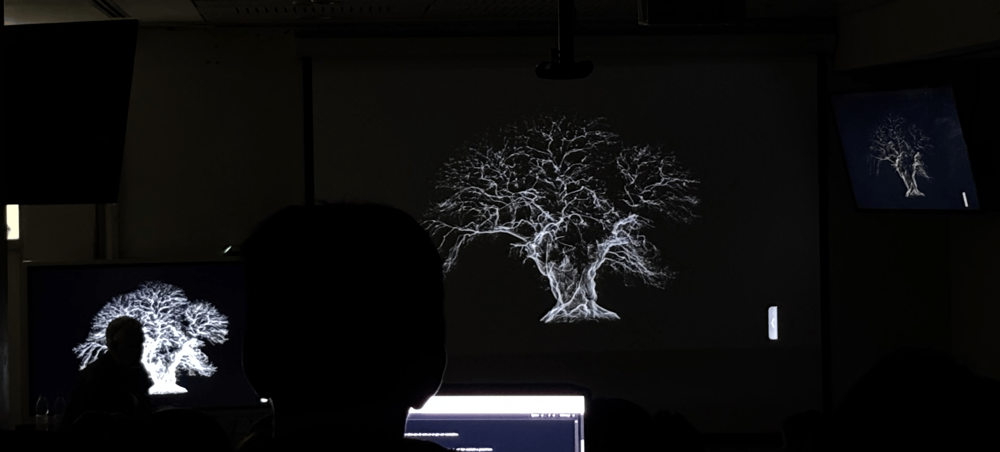

# sesion-10a

Martes 19 de mayo

## Charla

### For want or (not) measuring

Los artistas ingleses Patrick Adam Jones, Jim Hobbs, Simon Withers y Philip Hudson presentan en CEINA la exposición For Want or (Not) Measuring, un proyecto iniciado en 2022 que explora cómo las personas perciben y utilizan las medidas, el tiempo y las escalas. Cada exhibición se adapta al lugar donde se realiza y va acompañada de publicaciones propias. 

Uno de los principales objetivos del proyecto es compartir el trabajo con distintas personas y culturas. Cada exposición se adapta al lugar, los artistas, etc. por lo que cada versión es única. Además, cada proyecto genera publicaciones propias, y hasta ahora han realizado alrededor de siete proyectos en diferentes lugares. 

Por su parte, Simon Withers trabaja con escáneres láser que miden el espacio mediante millones de puntos. El dispositivo emite un láser que rebota en los objetos y calcula las distancias según el tiempo que tarda en regresar. Aunque la tecnología está diseñada para medir, Simon se interesa más por las "nubes de puntos" que se generan y por cómo estas representan árboles, paisajes y diferentes escalas temporales.

“For us the trees are too slow, for the trees we are too fast and for the mountain the tree is too fast. It's about measures and scales”

Me parecieron muy interesantes las propuestas de los artistas, especialmente la forma en que utilizan herramientas de medición para crear sus obras. Me impresionó cómo pueden llegar a resultados tan cool y visualmente atractivos a partir de un escáner láser.

---

## Clase

En esta clase conocimos el funcionamiento del chip 4046, un VCO (oscilador controlado por voltaje). Esto significa que la frecuencia cambia según el voltaje que recibe.

- Voltaje bajo = frecuencia lenta.
- Voltaje alto = frecuencia rápida.
- A diferencia del 4093, no se controla con resistencias, sino directamente con voltaje.
  
Después trabajamos con Benjamín, Nico, Lucas y Bruno para definir cómo usaríamos los piezos.

### Idea 1: Piezo tipo Taiko

- El piezo detectaría los golpes sobre una superficie.
- Cada golpe activaría el sintetizador.

### Idea 2: Piezo en el cuello

- El piezo se colocaría como un choker.
- Detectaría las vibraciones de las cuerdas vocales.
- Esto permitiría activar usando la voz.
  
También conversamos sobre una idea propuesta por Bruno:

Hacer una PCB flexible para adaptarla al cuello, funcionando como un chocker, la idea era interesante y nos gustó, pero después de hablar con Misa entendimos que sería más difícil de fabricar y podría aumentar el costo del proyecto (ᴗ_ ᴗ。)
