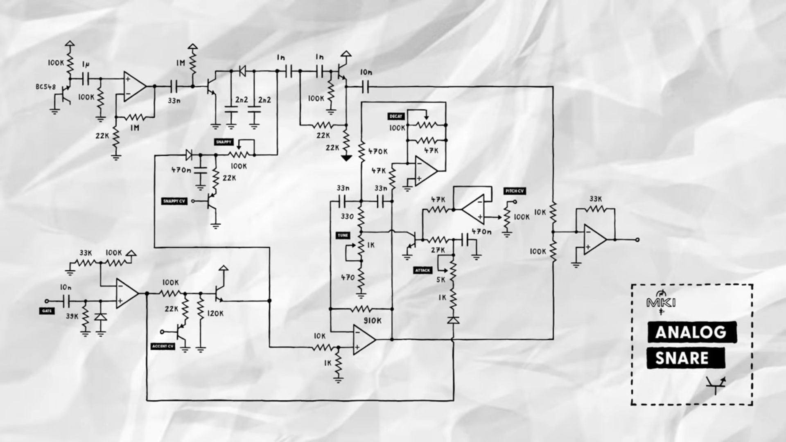
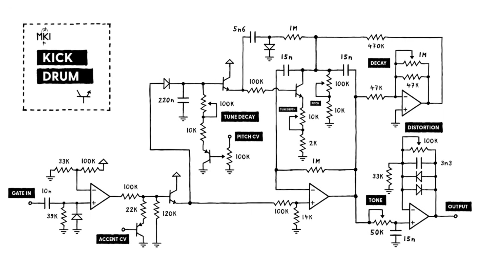

# sesion-10a

## 19 de mayo del 2026

### Desarrollo en clase

Con nuestro equipo de trabajo estuvimos investigando diferentes opciones de percutores para elegir.

Unos de ellos eran demasiado elaborados para el nivel de comprensión que tenemos.

Cabe añadir que también tuvimos que descartar debido a algunos componentes o tipos de voltajes requeridos para estos.

### Maquinas y referentes históricos

+ Roland TR-808
+ Roland TR-909
+ Simmons SDS-V

### Historial de investigación

+ Designing a TR-808 style snare drum from scratch-Moritz Klein

Circuito que puede emular un TR-606, TR-808 O un TR-909.

https://www.youtube.com/watch?v=hULEn2_4Unw

+ Designing a simple analog kick drum from scratch-Moritz Klein

Clásico Roland-inspirado kick drum análogo.

[Link video youtube](https://www.youtube.com/watch?v=yz37Yz315eU)

+ Designing a TR-606 style hi-hat from scratch-Moritz Klein

 Simple, pero muy versátil y de sonido crujiente DIY circuito hi-hat.

[Link video youtube](https://www.youtube.com/watch?v=zbBY7JL9nnQ)

+ Generador de Percusión Para Ritmos Musicales-ART1596S

[Link página web](https://newtoncbraga.com.mx/articulos/9-articulos-tecnicos-y-proyectos/31055-generador-de-percusion-para-ritmos-musicales-art1596s)

+ Generador de Percusión Para Ritmos Musicales-ART1596S

[Link página web](https://www.incb.com.mx/index.php/articulos/9-articulos-tecnicos-y-proyectos/9910-generadores-de-percusion-art858s)

## Encargo cap 4 y 5

+ Capítulo 4
  
Dentro del 4to capítulo se aborda la forma de tomar fotografías, visto desde un punto de vista como la cacería, como ejemplo, refiriéndose al fotógrafo como cazador y a su objetivo como caza. Incluyendo un entorno el cual sería un bosque lleno de objetos culturales, en este el fotógrafo o cazador no buscaría algo en específico, este busca las diferentes variables que le permite encontrar viendo las cosas desde diferentes perspectivas. El concepto de la fotografía y su apreciación es relativa, ya que no existe un punto de vista absoluto. Por eso el fotógrafo considera que para fotografiar se tiene que buscar lo más "apto".

+ Capítulo 5
  
En el capítulo 5 se analiza y habla de la fotografía como un objeto, mencionando que las imágenes en B&N son alejadas de nuestra realidad, ya que como menciona, el blanco y negro representa condiciones extremas de falta o presencia de la luz.
El autor plantea por qué una fotografía en blanco y negro está más alejada de la realidad que una imagen a color, aunque las fotografías a color estén más cerca de la realidad, no terminan siendo reales, solo que lo hacen parecer más.
