# sesion-09a

- ## semana de solemnes!!!!
  - clase más relajada para no explotar mentalmente
    - decidímos ir a ver una charla importante de artistas que van a abrir una exposición en en CEINA
   
- ## For Want of (not) Measuring
  - es un proyecto colaborativo grupal de artistas que hablan sobre el sistema de medir y sus implicaciónes en sus usos cientificos y poeticos
    - https://www.sullivanstrumpf.com/exhibitions/for-want-of-not-measuring
  -  La charla la dió **Jim Hobbs** y **Patrick Adam Jones**
    - antes de iniciar a trabajar juntos ya trataban temas parecidos
      - ambos sobre "el medir"

- Jim Hobbs cuenta que cuando era más pequeño (niño) su padre medía la potencia de las luces de autos con grillas
  - cuenta que al examinar estas grillas, se dió cuenta que no son estables
    - le interesan estos sistemas que afirman ser estables y seguros/rigidos
      - pero al examinarlos uno puede ver la fragilidad y desigualdad de las supuestas lineas equidistantes

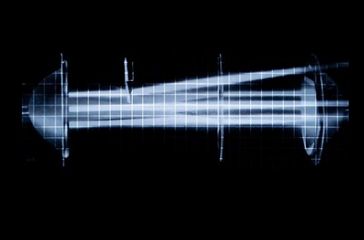

- Patrick nos habló más sobre lo absurdo que es "el medir"
  - y aceptar sistemas impuestos sin cuestionarlos
    - nos contó sobre un grupo de cientificos que en los 1700's intentaron medir el peso del planeta
      - escalaron una montaña en escocia con equipamiento
        - en esa epoca se aproximaron a un 80% de lo que se estíma hoy en día
  - Patrick mencionó que parte de un proyecto suyo es/fué escalar la misma montaña repetidas veces con un instrumento para medirla

  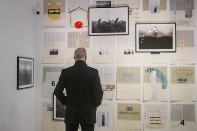

  - más en cuanto al proyecto colaborativo
    - se han hecho varias versiones en distintas ciudades
      - cada expo es distinta ya que se agrupan con artistas locales
        - y crean una publicación que dan en cada versión
          - se cuestionaban; "Que es una publicación?"
            - por lo que algunas son fanzines, audios, imagenes, flexidisc 👀
  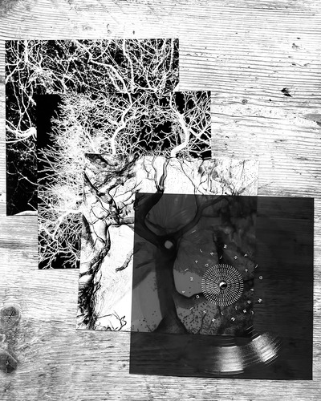

    - también están creando una pagina donde van a recopilar todas las reiteraciónes del proyecto
      - pero no está abierta para el publico todavía
    - nos mostraron un dispositivo que usaron para hacer unos de los trabajos en el proyecto
      - no recuerdo el nombre pero tiene 2 espejos que giran dentro de el
        - sale un laser que rebota de las superficies y se devuelve al dispositivo para "*medir*" la distancia entre estos
          - lo que hacen es usar estos datos y los transfieren a un programa que crea "point clouds"
            - la gracia de esto es que las nubes no se pueden medir ya que no tienen bordes
              - no hay un fin/corte abrupto que sea medible
    - "para nosotros el arbol es lento, para el arbol nosotros somos rapidos"

   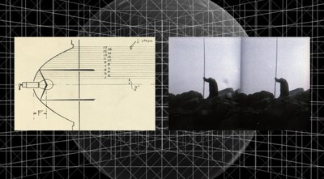 (*imagen de la expo*)

tengo planeado ir el sabado, ojalá me pueda llevar uno de los flexidisc

  - ## final de clases
    - con misaaaaa revisamos las ideas para la entrega 2
      - con mi grupo (piezo/entrada) teníamos 2 ideas en mente
         - una entrada tipo Taiko (juego de tambores) donde al pegarle al piezo, un 4017 avanza en sus steps
           - 
         - otra idea **era** tener un piezo en un collar (tipo choker o correa) que capte la señal y la use para hacer sidechain en un synth
           - lamentablemente la idea original no es muy posible de hacer ya que necesitaríamos una flex-pcb y podría llegar a ser muy complicado
             - si podriamos hacer que con la señal del piezo, un 4017 avance (en vez de hacer sidechain) y que el piezo **si** esté en un choker pero que el resto de la placa/componentes estén externos en un compartimento
      - inspo/referentes para las ideas
        - https://github.com/polykit/kosmo-sidechain
        - https://github.com/22bits/Matrinicas/blob/master/Hybrida/HYBRIDA_Esquematico.pdf (gracias misaaaaa)
       
-----------------------------
       
  - ### extra no musica (más o menos) sino arte(?)
  - 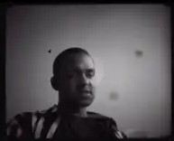
    - Jasper Marsalis (fka. Slauson Malone / Slauson Malone 1)
      - artista contemporáneo y musical
        - personalmente mi artista favorito
          - conceptualmente muy pensado y refrescante
      - quería hablar de su trabajo **"A Quiet Farewell" / "Crater Speak" / "Vergangenheitsbewältigung" / "for Star"**
        - una serie  que utiliza musica (1 Album / 1 EP / 1 Single), exhibiciónes (1 Instalación) y libros (3 Libros)
          - sin contar los conciertos donde presenta la musica
        - no tiene correlación directa con "**For Want of (not) Measuring**" pero me recordó en cuanto a como hablan y en parte la estética
          - Jasper, en este proyecto habla sobre las injusticias en contra de gente afro-americana en Estados Unidos y en sobre las catastrofes creadas por el humano
            - habla sobre el tiempo, la existencia y in-existencia de ideas/objetos/momentos
            - "On its surface, AQF, 2016–2018 (CS) channels the emotions of the **Anthropocene**"
              - Anthropocene siendo; "(el) impacto global que las actividades humanas han tenido sobre los ecosistemas terrestres"
            - "Crater Speak is the expression of presence as absence (and vice versa). Its existence formed by lack and loss. Destruction as its creation, branded by alien force. Instead of focusing on the spectacle of origin, I propose focusing on its nowness. It’s absent voice/stare/body/place."
           
      - trata la palabra "Vergangenheitsbewältigung", una palabra en alemán que traducida (lo mejor posible) al español significa "llegar a acuerdo con el pasado"
        - no ignorar o aceptar lo ocurrido, pero entender y llegar a acuerdo con el
        - habla sobre el "Crater" como este agujero que se presenta frente a la situación que el (y gente como el) vive, como la mejor opción
          - dejarse caer en el caos y absorber todo y aprender/conocer/**observar** todo lo que fué/esta siendo/será

  - Ejemplo de cada faceta del proyecto:
    - "A Quiet Farwell, 2016–2018 (Crater Speak) / Vergangenheitsbewältigung (Crater Speak)"
      - colección de musica que incluye las 2 de 3
        - 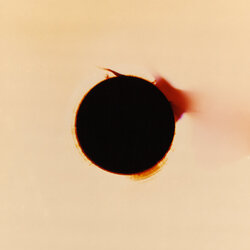
        - https://slausonmalone.bandcamp.com/album/a-quiet-farwell-2016-2018-crater-speak
          - esta siendo la "principal"
            - **uno de los mejores albumes de la vida** ❗
              - producción unica (propia de Jasper)
            - me abrió la mente a lo que realmente se puede hacer
              - salír de lo que se entiende como un producto final/aceptable
        - 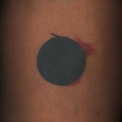
        - https://slausonmalone.bandcamp.com/album/vergangenheitsbew-ltigung-crater-speak
          - seguimiento a "A Quiet Farewell"
            - EP con versiones acusticas del anteriór
              - de alguna manera logra traspasar lo caótico y experimental al instrumentos no digitales (si utiliza instrumentos/efectos digitales pero no son lo principal)
              - con orquestaciónes preciosas
                - principalmente su guitarra
    - 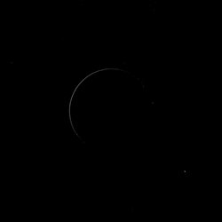
    - "for Star (Crater Speak)"
      - seguimiento y la tercera (ultima) parte de la faceta musical del proyecto
      - https://slausonmalone.bandcamp.com/album/for-star-crater-speak-2
        - 2 canciones
          - la primera sigue conlos mismos elementos de las canciones pasadas
            - un poco más distorcionada/minimalista(?)
          - la segunda siendo el final (y el futuro*)
            - ambiental con elementos vagos de los proyectos anteriores

    - "A Quiet Farwell, 2016–2018 (Crater Speak)" es el pasado
    - "Vergangenheitsbewältigung (Crater Speak)" es el presente
    - "for Star (Crater Speak)" es el futuro
   
  - también tiene "Stadium"
    - una instalación que hizo junto a "Midway Contemporary Art"
    - 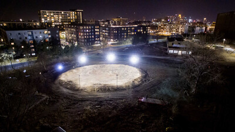
      - "Crater Speak is the expression of presence as absence (and vice versa). Its existence formed by lack and loss. Destruction as its creation, branded by alien force. Instead of focusing on the spectacle of origin, I propose focusing on its nowness. It’s absent voice/stare/body/place."
     
  - y la trilogía de libros
    - 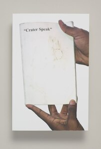
      - (esta es la segunda edición)
    - mientras el libro evolucióna, va perdiendo sentido
      - tuve la oportunidad de preguntarle si el presentaba el libro como algo absurdo (en el buen sentido) y me dijo que no, que lo presentaba como algo absurdo en el mal sentido
        - ve el libro como algo que pierde el sentido y que (por lo menos la ultima versión) no tiene significado
          - es una recopilación de imagenes que encuentra interesante
            - una cara del libro son 2 imagenes de un señor que se encontró en una disco
              - le tomó fotos y las puso en el libro
                - no sabe quien es
        - (quería comprar uno de sus libros hace años y me tuve que contactar con el museo que trabajó con Jasper para saber si sacaría otras versiones, me dijieron que estaba trabajando en la ultima y que me pondrían en la lista de espera. logré comparlo después de como 3 años y soy demasiado feliz)
               
  - realmente un personaje importante e interesante
  - ## otras cosas que ha hecho:
    - 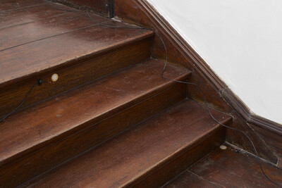
    - 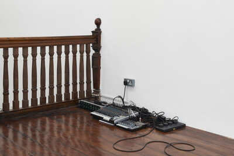 (*instrument 2*)
      - en una exposición conectó piezos a una escalera de la galería para capturar el sonido de la gente subiendo/bajando
        - contact mics, mixers, DIs, speakers, cables dimensions variable
    - 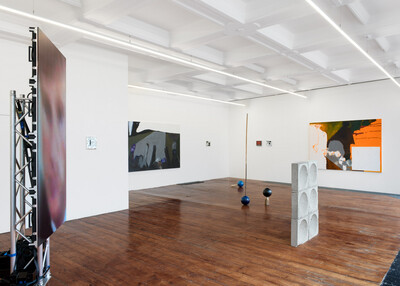 (*expo en Emalin, London, UK*)
    - https://slausonmalone.bandcamp.com/album/excelsior
      - el ultimo album que ha sacado
        - también fantastico
    - https://www.youtube.com/watch?v=UDgotX7qFKY (live)
    - https://www.youtube.com/watch?v=dcWG08_zgjk (live)
    - https://www.youtube.com/watch?v=UStKlIpw72k&t (live)
   
### **porfavor escuchen su musica o vean sus obras es un capo hace todo bien, es impactante**
