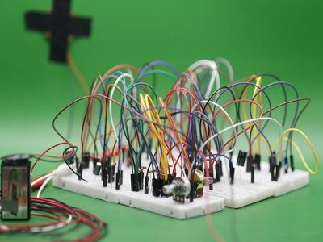
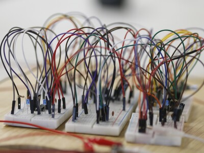
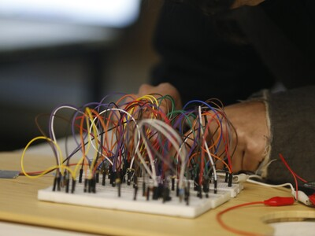
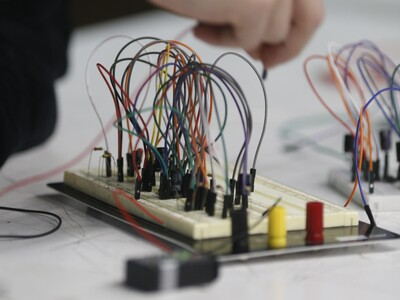

# sesion-12b

- ## entrega 2 !!!!!
  - no saqué muchas fotos, eso sí emi fotografa nos compartió unas!!!

 
 

>tantos cables wow

- todas las presentaciónes fueron bonitas
  - se mostró el proceso más tecnico pero también como la pasaron, los errores y triunfos
    - me encantó ver como funcionaban los circuitos de otros grupos que no tuve la oportunidad de oír ya que estabamos trabajando en el nuestro
- en cuanto a nuestra presentación logramos lo que queríamos
  - buen feedback para tener en mente para futuros proyectos
    - ya estoy preparando otro circuito que tengo que revisar
      - me alegra que me interese la materia y me den ganas de hacer cosas propias siendo que no tenía ni idea de como funcionaba nada de esto hace unos meses
     
-----------------------

- ### mini musica recomendación
  - https://jefrecantu-ledesma.bandcamp.com/album/in-summer
    - Jefre Cantu‐Ledesma
      - bello album
        - noise / ambiental
          - tiene cosas medias vaporwave(?) siento yo
      - todo se siente grande y viejo
        - probablemente por el uso de sonidos tipo tape-loops y grano de vinilo'ish
          - y los synths que usa ( 2:58 en "Love's Refrain")
            - quizas usa reverb/delay o algo para aumentar el efecto
      - **recomiendo:**
        - "Love's Refrain"
        - "In Summer"
