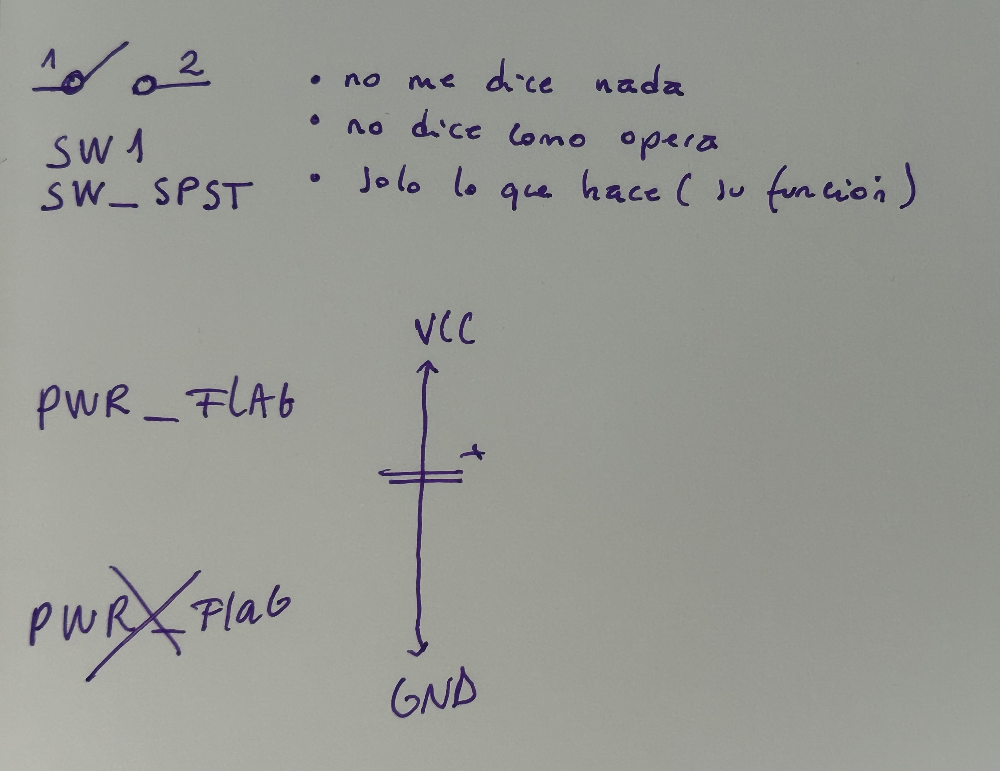

# sesion-10b

Componente (R) / Valor (10k) / Huella (6.7 mm) 

## Clase de revisión de dudas 

Dato: Misa subió un glosario de KiCad :) 

1. Duda sobre huellas 

+ F: editar campo de huella 
+ Confusión entre SMD y THT 
+ Tipo de encapsulado: Dual In-line Package (THT), solo Package (SMD)

Usar: DIP 7.62 de ancho; es el más común (LongPads). 

2. Cómo cambiar la posición de las patitas del chip

Importante: no editar las cosas originales de KiCad. 

Para eso, hacer un fork. 

**Ejemplo:**

+ 555 
+ Letra E 
+ Editar símbolos (no de biblioteca) 
+ Seleccionar pin y presionar M para reubicar 
+ Se debe guardar para mantener el cambio

**Para guardar mis símbolos:**

+ Editor de símbolos 
+ Archivo 
+ Nueva biblioteca 

Temporary → pulsadores 

Push buttons 

+ No - abierto (normalmente abierto) (más común) 
+ No - conectado 

+ Palanca 
+ Switch 
+ Estados

**Comentarios sobre el capítulo en clase:**

+ Un velo al mundo 
+ Dejamos de ver el mundo 
+ Como Instagram

