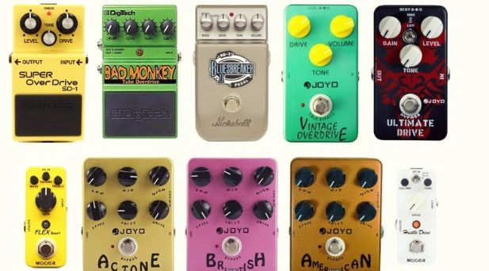
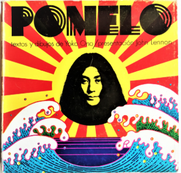
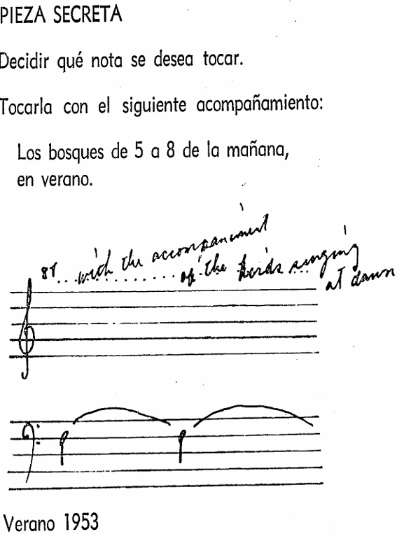
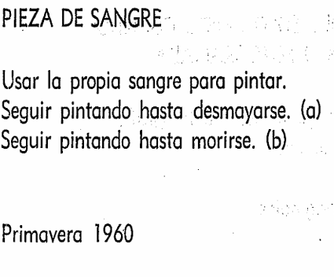

# sesion-13a  
**Falté porque me sentía mal y tuve problemas personales.**

##  Placas en proceso  
*(apuntes compartidos por mi compañera Vanessa García)*  

- **Exportar:** en formato **Gerber**.  
- **Capas mínimas (7):**  
  - F.Cu / B.Cu → cobre frontal y posterior  
  - F.SilkS / B.SilkS → serigrafía (nombres y símbolos)  
  - F.Mask / B.Mask → máscara de soldadura  
  - Edge.Cuts → contorno de la placa  
- **Archivo de taladrado** obligatorio.  
- **Visor Gerber:** revisar que todo esté coherente antes de enviar.  
- **Precaución:** no cubrir las referencias de los componentes con gráficos (ejemplo: U2).  

Fabricar placas implica un costo alto, requiere inversión importante.  

##  Carcasas  
- Ejemplo: **pedal de guitarra**.  
- Se pueden construir con distintos materiales, según necesidad.
  

##  Componentes  
- **Vitronics** ofrece precios más bajos (compra online).  

##  Proyecto-03  
- Revisar los Gerber y compararlos con las correcciones recibidas.  
- Decidir si seguimos en el mismo grupo (sí, mantenemos).  
- Elaborar listado de materiales (chips, placas, etc.).  
- Soldar 3 placas de las que diseñamos.  
- Presentar propuesta de dos partituras.  

---

## cap 1 pomelo yoko ono :)
Al leer el primer capítulo de Pomelo, lo que más me llamó la atención es que está escrito como un instructivo. No son  tradicionales , sino órdenes simples que me obligan a imaginar, a actuar, a escuchar de otra manera. Yoko Ono explica con instrucciones directas que convierten lo cotidiano en arte. 

Entre todas las piezas, hay algunas que me llamaron la atención. La Pieza secreta :  tocar una nota acompañada por los bosques al amanecer. Es como si la música no estuviera en el instrumento, sino en el mundo. El bosque, los pájaros, el aire frío se convierten en parte de la composición. Es un instructivo que me enseña a escuchar el entorno como si fuera una orquesta.

También me  gustaron mucho las piezas de risa y tos. Pasarse una semana riendo o un año tosiendo son instrucciones  raras, pero revelan algo: el cuerpo ya es un instrumento. La risa se convierte en ritmo, la tos en percusión. Yoko me muestra que incluso lo involuntario, lo frágil, lo incómodo, puede ser música. Es un instructivo que me recuerda que mi propio cuerpo compone, aunque yo no lo busque. y es algo loco porque nosotros no andamos pensando en esas cosas, estamos tan efocados en otras cosas que no vemos el más allá de otras cosas.

Todo se convierte en música: el espacio, el tiempo, la memoria, lo invisible. Es un instructivo que me obliga a pensar que la música no está solo en lo que se oye, sino también en lo que se imagina, en lo que se recuerda, en lo que se transforma.

Algo  muy llamativo es que cada pieza está fechada con la estación y el año: “Invierno 1961”, “Verano 1962”… Esa manera de marcar el tiempo le da un aire de bitácora, como si fueran registros de momentos específicos en la vida de Ono. No es solo una obra abstracta,   sino un diario de instrucciones que se anclan en un tiempo y un clima.

## cap 2 
El segundo capítulo de Pomelo se llama pinturas, Yoko Ono no habla de cuadros tradicionales. En vez de eso, escribe instrucciones que convierten acciones o ideas en obras. Es como un manual, pero poético: cada pintura es algo que se hace o se imagina.

Un ejemplo fuerte pieza  con sangre. La instrucción es sencilla pero impactante: usar sangre para pintar. No se trata de lograr una imagen bonita, sino de mostrar que la pintura puede venir del cuerpo, de lo más íntimo. mezcla fragilidad y fuerza, porque la sangre es vida, pero también dolor. Esta pieza me llamó mucho la atención, ya  que la pintura no es solo color sobre tela, sino cualquier gesto que transforme la manera de mirar el mundo

El resto del capítulo sigue esa misma lógica: hay pinturas hechas con viento, con agua, con luz, con sombras, con gestos simples como clavar algo o dejar que una planta crezca. Algunas son imposibles de realizar, otras son muy cotidianas, pero todas muestran que pintar no es solo usar colores, sino transformar la manera en que miro el mundo (como dije anteriormente).

 Yoko Ono escribe como si diera un manual para pintar con lo que tengo alrededor: el viento, el agua, la luz, o incluso mi propio cuerpo. Lo que más me llama la atención es su forma de hacerlo: instrucciones simples, fechadas en estaciones y años, que convierten la vida misma en arte.

