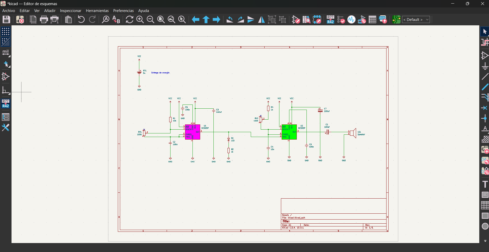
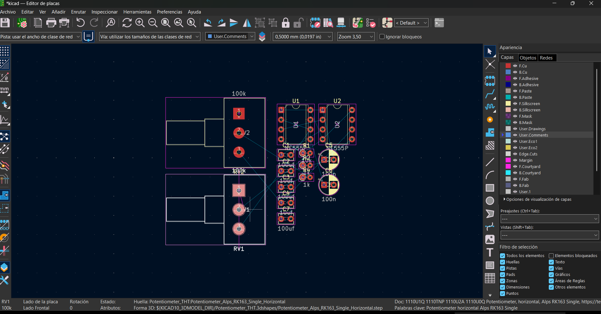
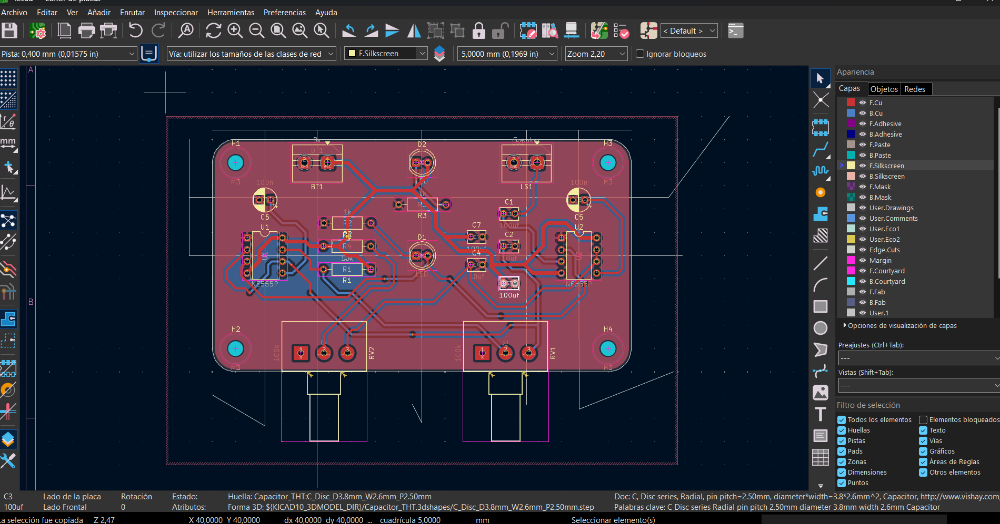
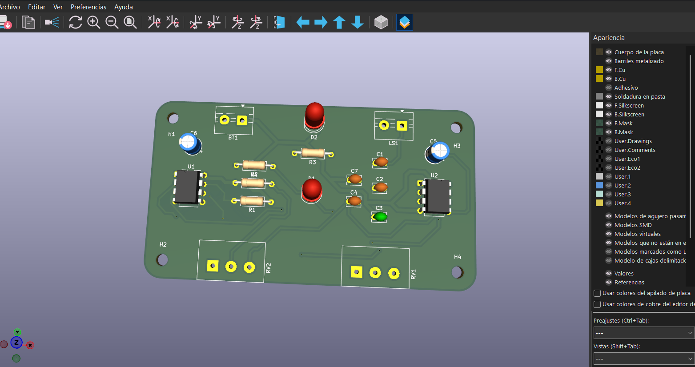
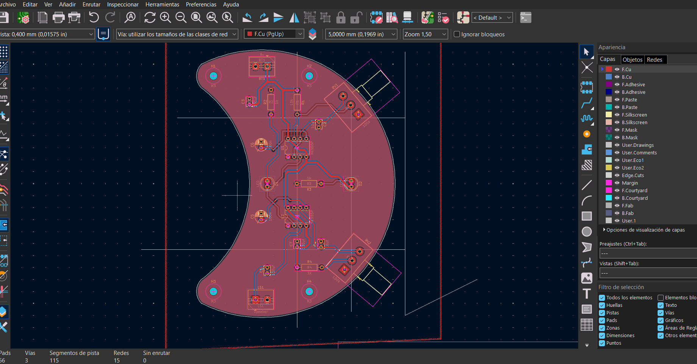
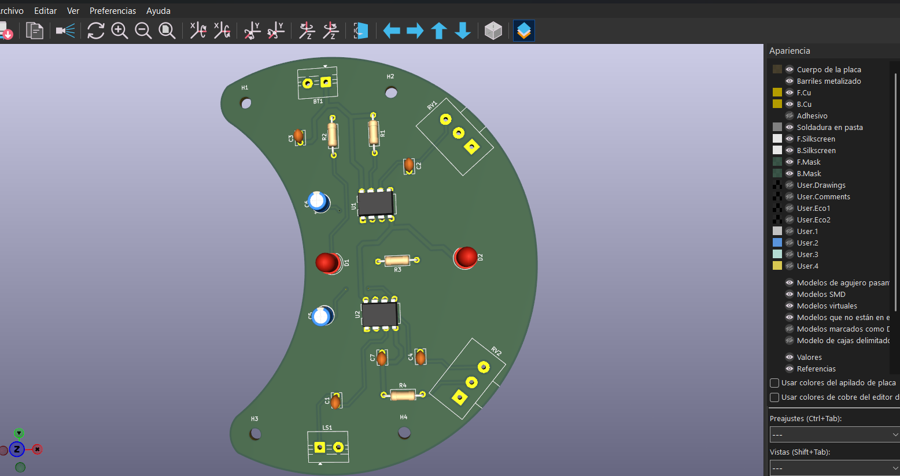
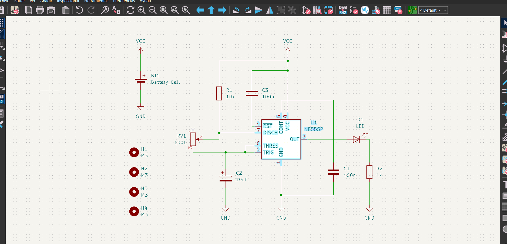
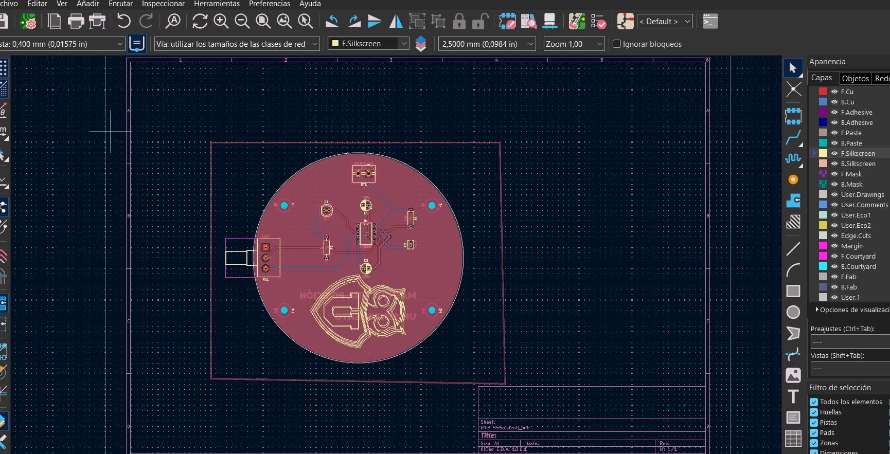
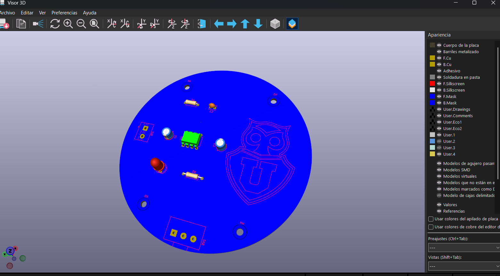

# sesion-09a

12-05-2026

Clases online por incidente en República  
*(no me gustan mucho las clases online)*

## Apuntes de la clase

### Repaso
- La primera parte de la clase fue un repaso de lo visto en la sesión anterior en **KiCad**.

### Desarrollo
- Primero le dimos **contorno a la placa**, utilizando una medida similar a una **tarjeta de presentación (90 × 50 mm)**.
- Luego **organizamos los componentes** de la mejor manera posible dentro del contorno, pensando en el **usuario final** y en la claridad del diseño.
- Para facilitar esta organización, **activamos grillas en una capa específica**, lo que nos ayudó a **posicionar los componentes de forma más precisa y ordenada**.
  

- En la segunda parte avanzamos con las **capas de cobre**.
- Se trabajó con dos *pindrills*:
  - **0,4 mm**
  - **0,8 mm**
- El dibujo de las pistas se realiza en las capas:
  - **F.Cu**
  - **B.Cu**

Estas capas corresponden a las pistas de cobre, que funcionan como el equivalente a los cables dentro de una **protoboard**.

- Mientras dibujábamos las líneas de cobre, podíamos pasarnos a la capa trasera usando la letra **V**, lo cual fue increíble.
- Al terminar de dibujar, asignamos **ambas capas como GND**, haciendo que toda la placa fuera tierra.
- Luego **dimensionamos la placa** y finalmente presionamos la tecla **B** para rellenar las zonas de cobre.  
  Con eso, la placa quedó lista.

  

Al terminar, colocamos las **tuercas M3**, que según Misa son *geniales, increíbles y fabulosas*, pensando en que a futuro la placa pueda **montarse en una carcasa** o **fijarse en algún soporte**.

### Comentario personal
Esta parte me gustó mucho, ya que me recordó a un juego de celular donde había que organizar tubos para que fluyera el agua.  
Pasé muchas horas jugando algo muy parecido 

#### Encargo

#### Primera versión 
Utilicé el esquemático de la Ataripunk, pero quise jugar con los contornos de la placa.
Me costó bastante el proceso, ya que al principio no lograba reconocer bien las uniones ni definir qué quería que fuera la placa, y en varios intentos el diseño no me permitía formar la figura que tenía en mente.

Finalmente me quedé con esta forma y decidí colocar los potenciómetros en ángulo. El resultado me gustó mucho, especialmente por la figura de medialuna que se generó, tanto a nivel visual como de identidad del objeto.

#### Segunda versión – Circuito 555 Astable

Para mi segunda versión realicé un **circuito 555 en configuración astable**.  
Lo que más me ha costado hasta ahora ha sido encontrar las **huellas**, pero a pesar de eso no tuve mayores problemas durante el desarrollo.

#### Tabla de huellas (para recordar)

| Componente                         | Huella en KiCad |
|-----------------------------------|-----------------|
| Capacitores cerámicos             | `Capacitor_THT:C_Disc_D3.8mm_W2.6mm_P2.50mm` |
| Resistencias                      | `Resistor_THT:R_Axial_DIN0207_L6.3mm_D2.5mm_P10.16mm_Horizontal` |
| Capacitores con polaridad         | `Capacitor_THT:CP_Radial_D5.0mm_P2.50mm` |
| LEDs                              | `LED_THT:LED_D5.0mm` |
| Potenciómetro                     | `Potentiometer_THT:Potentiometer_Alps_RK163_Single_Horizontal` |
| Parlante                          | `TerminalBlock:TerminalBlock_MaiXu_MX126-5.0-02P_1x02_P5.00mm` |
| Chip de 8 pines (555 y LM386)     | `Package_DIP:DIP-8_W7.62mm` |
| Batería 9V                        | `TerminalBlock:TerminalBlock_MaiXu_MX126-5.0-02P_1x02_P5.00mm` |
| Separadores (tornillos M3)        | `MountingHole:MountingHole_3.2mm_M3` |

Una vez agregadas todas las huellas, di el **esquemático por finalizado** y continué con el diseño de la PCB.

#### Diseño de la PCB
La **PCB** fue diseñada de forma **circular**:
- **Cara frontal:** logo  
- **Cara posterior:** frase

El diseño está inspirado en el club de mis amores, **:contentReference[oaicite:0]{index=0}**, incorporando su lema:  
*“Más que una pasión, un sentimiento”*.

#### Lectura de libro de Flusser, capítulo 1

Al leer el capítulo 1 me di cuenta de que la imagen, y especialmente la fotografía, puede terminar limitando mi imaginación. La foto congela un momento, pero no alcanza a mostrar todo lo que hay detrás: la situación completa, el antes y el después, el contexto real. Cuando leo una situación, mi mente se activa y la imagino a mi manera, llenando los vacíos con mis propias ideas y experiencias. En cambio, cuando veo una fotografía, siento que mi interpretación queda más cerrada, como si la imagen me empujara a pensar de una sola forma y me costara salir de ese encuadre.

Otra conclusión que saqué del capítulo es que la fotografía no es tan objetiva como solemos creer. Aunque muchas veces confiamos en una imagen porque “muestra la realidad”, en verdad esa realidad ya está filtrada por el aparato y por decisiones que no siempre percibimos.
