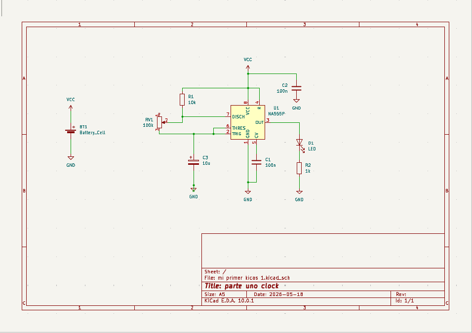
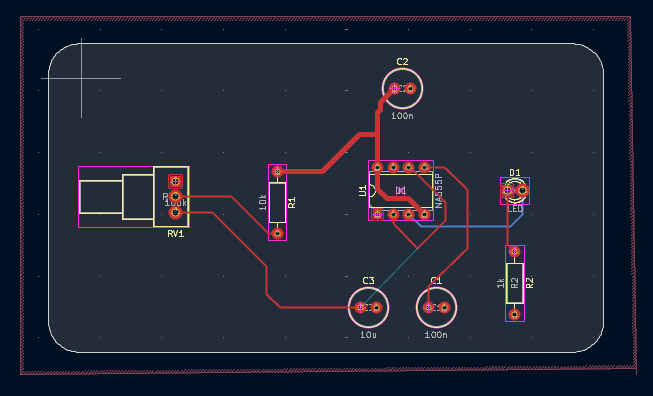
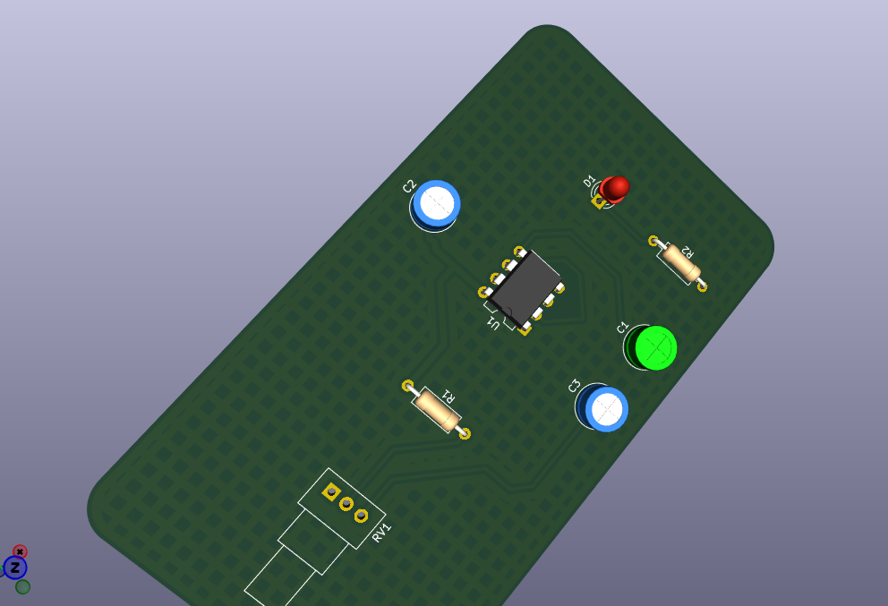
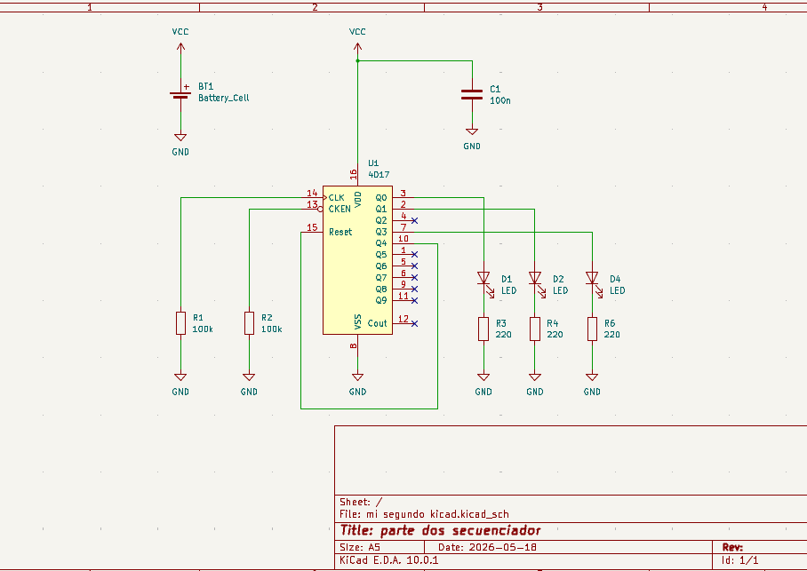
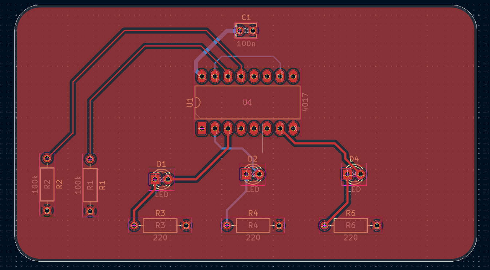
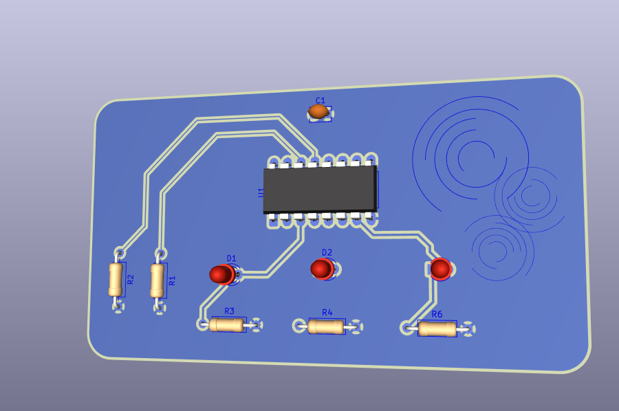

# sesion-09a

## Apuntes de la clase:

### KiCad

G: mover todo incluido cables

V: valor

A: agregar símbolos

ESC: herramienta selección

M: mover componente

F: revisar huella asignada al componente

E: revisar/editar hoja de vida componentes

#### Editor de placas

Botón: actualizar placa desde esquema / F8

ALT + 3: visor 3d 

Tamaño placa: 9x5cm

Para partir dibujando la placa, es mejor partir con una grilla gruesa: 5 mm

Capas Edge.Cuts (cortes del borde): para generar contorno de la placa

Origen: 50, 50 (eje x, y)

Dibujar arcos de 5 mm de radio para redondear puntas

Rectángulo > E > Rectángulo redondeado > Radio de redondeo: 5 mm

Luego del contorno, cambiar a grilla de 1 mm

#### Pistas

Los recorridos (cables) que tienen las placas.

El grosor de las pistas depende de cuánta corriente fluye por ellas. Pistas más anchas, más corriente.

***jlcpcb.com/capabilities***

Para trabajar en los márgenes de lo que se trabaja en la realidad.

Pistas más delgadas: 0.4 mm

Pistas más gruesas: 0.8 mm

Al trabajar con doble pantalla con el editor de placas, al seleccionar un componente y  tener el esquemático al lado, se puede ver dónde se está seleccionando.

Con la capa **User.1** se pueden crear márgenes. Esta capa no se agrega como información de la placa.

Manteniendo apretado **Ctrl** al mover un componente no se adhiere tanto a la grilla.

Un buen criterio de diseño es colocar los leds en la misma orientación.

#### Colocar pistas

F.Cu: Front Cobre

B.Cu: Back Cobre

Elegir “pincel” de pista

Recomendada la más gruesa para conectar los positivos

X: Enrutar pista única

Utilizar pista más delgada para conexiones más chicas y cambiarse a la capa de abajo.

V: para pasar de la capa frontal a la trasera.

#### Vía

Es un pequeño cable que atraviesa la placa de un lado a otro a través de un hoyito.

Para hacerla, hay que empezar a trazar la pista por una capa, llegar a donde no pueda pasar, apretar V y seguirá por la otra capa.

Tamaños recomendados:

- Diámetro:  0.5 mm
- Orificio: 0.3 mm

#### Ground

El ground se deja para el final

Se hace que toda la placa sea ground

Herramientas dibujar zonas rellenas

Con el click se despliegan las propiedades > Marcar capas [F.Cu](http://F.Cu) y [B.Cu](http://B.Cu) > Nombre de red: GND

Red significa cable

Basta que el contorno sea alrededor de la placa y que quede bien cerrado

Terminar todo con letra **B** de background

Esto hace que todos los espacios vacíos de la placa sean ground también

#### Hoyitos de montaje

Pernos estándar M3

Agregarlo como componente en esquemático > MountingHole

Agregar 4 

Valor: M3

Asignar huellas: MountingHole_3.2mm_M3

Pasar al editor de placa >Traer huellas nuevas > Agrandar grilla > Colocar en las esquinas

#### Ornamentar

En capa F.Silkscreen / B.Silkscreen

Archivo > importar > gráficos. Asegurarse de la escala.

------------------------------------------------------------------------------------------------------
### Encargo:
#### 01. Esquemáticos y PCB en KiCad

En cuanto a los esquemáticos, no tuve ningún tipo de problema más complejo que olvidar los comandos, lo que solucioné revisando los apuntes de la clase.

Lo que si olvidé fue cómo cambiar las patas del chip, pero sé que lo vimos en la clase del viernes y repasando eso lo puedo aprender.

pinchando cosas llegué a la opción!! así que se logró :) 

**parte uno - clock - esquemático**

**parte uno - clock - pcb**

No tuve mayores compliciones para la PCB hasta llegar a ground, seguí los pasos tal cual la clase y en vez de hacerse un relleno quedaba como un borde, incluso apretando B.

Al pasarlo al visor 3D se me veía así, no sé si esté bien:

**parte dos - secuenciador - esquemático**

Acá el único problema que se me presentó fue que no supe como etiquetar la parte del clock para conectarlo a esta parte del circuito.

**parte dos - secuenciador - pcb**

Me costó encontrar una huella para el chip 4017 y al buscar me apareció esto:

El 4017 no requiere descargar un footprint especial de internet, ya que usa un empaque estándar de circuito integrado de 16 pines (DIP16).
• Abre el **Asociador de huellas** (*Assign Footprints* o *CvPCB*).
• En el filtro de búsqueda, escribe **`Package_DIP:DIP-16`** si vas a usar un zócalo o perforar la placa.
• Si planeas soldar el componente directamente en montaje superficial, busca **`Package_SO:SOIC-16`** o el formato **`TSSOP-16`** según la variante específica que indique el *datasheet* de tu componente

Así que utilicé una de esas.

Acá sí logré hacer el ground! Ni idea por qué no me funcionó el anterior… pero lo bueno es que creo que ya tengo claro como hacerlo

_probando colores y formas de la placa_

------------------------------------------------------------------------

#### 02. Lectura de libro de Flusser — Capítulo 1

- Las imágenes *signfican algo “exterior”,* y tienen la finalidad de hacer que ese “algo” **se vuelva imaginable para nosotros.**
- Al re-proyectar esta abstracción del exterior en la imagen, se le puede llamar *imaginación.*
- “Las imágenes son susceptibles de interpretación”. Las imágenes existen más allá de su soporte, ya que este permite ser visto y todo lo que vemos, será particular a quien lo haga, por lo que puede existir **una imagen** y a su vez **miles de significados** de esta.
- Me parece muy valioso que dentro de un texto que podría ser técnico, se incluya la idea de la magia. “Tal relación espacio- tiempo *(al referirse de pasar de las cuatro dimensiones a las dos de la imagen)* reconstruida a partir de las imágenes es propia de la magia, donde todo se repite y donde todo participa en un contexto pleno de significado”
- Me encantan los ejemplos de sobre las diferencias entre el mundo histórico y el mundo de la magia: **“en el mundo histórico, el amanecer es la causa del canto del gallo; en el mundo mágico, el amanecer significa cantos de gallo, y éstos a su vez significan amanecer.”** Incluso con este ejemplo, adelanta un poco la idea de que vivimos en base a lo que nos presentan las imágenes y los textos. Por ejemplo: “el hombre vive en función de las imágenes que él mismo ha producido” y “el hombre vive en función de sus textos, es decir, ocurre una *textolatría,* la cual es tan alucinante como la idolatría”.
- Al leer lo anterior, me recordó al libro La Palabra Mágica de Isabel Allende que leí hace poco, ella sostiene que “Cada país, cada grupo humano, posee su propia narrativa que lo define y lo impulsa, explica sus orígenes, provee unidad, carácter y sentido de identidad.” y además, “Hemos creado una historia sobre nosotros mismos, que creemos verdadera, la repetimos, la pulimos, guía nuestra conducta y determina cómo percibimos el mundo y nuestro lugar en él”. Al volver al ejemplo anterior, podemos ver cómo generar un cambio en un par de palabras hace que el percibir nuestra realidad pueda ser más mágico.
- Isabel Allende en su libro habla de la importancia del relato y cómo narramos nuestra propia realidad, y da ejemplos muy similares a Flusser, como con el cristianismo ortodoxo, y demuestra las consecuencias que generan la *textolatría*, con distintas religiones, creencias y los relatos de quienes tienen el poder.
- El texto aborda cómo los textos y las imágenes son mediadas por el humano, pero que finalmente vivimos en función de ellas, ya no se descifran ni se decodifican, ya no son imaginables. A pesar de que sitúe en el siglo XIX, es una problemática que suena bastante actual. Por lo que, a través de la reflexión, me puedo quedar con la idea de que a pesar de esto, lo importante es tomar consciencia y volver a crear nuestros propios relatos e imágenes nutridas del mundo mágico. Es importante que nuestras narrativas tengan magia, sensibilidad, y que estén mediadas por nosotros mismos, dejando de vivir exclusivamente con los relatos que ya están establecidos.
