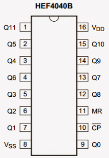
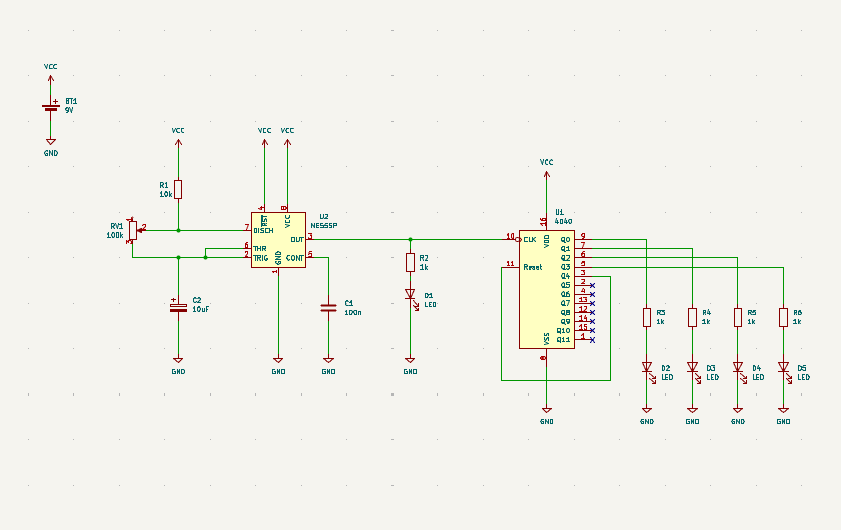

# sesion-10b

## Primeras pruebas de secuenciador

Misaa nos recomendó el chip 4040.
El día de hoy estuvimos haciendo las primeras pruebas con este.
El secuenciador nos da la posibilidad de hacernos cargo de cuando suena, y de cuanto (regular el voltaje).

Es un contador binario de 12 etapas.

El chip tiene 16 pines, hay 8 outputs.

Probaremos con 4 pasos

8 es GND

16 es VCC

Y el 10 se conecta al clock

El reset (11) lo conectamos al pin 3 (paso 5)

En el caso de que se hubieran conectado los 12 pasos, el reset se conectaría directamente a ground.

Para poder visualizar mejor como iría la conexión entre estos, creé un esquemático en KiCad muy a la rápida del clock + secuenciador:

