# sesion-09a 12.05

> Online por el incendio

## KiCad — Atajos de teclado

| Tecla | Qué hace |
|-------|----------|
| `A` | Agregar componente |
| `R` | Rotar componente |
| `G` | *Grab* — mueve el componente arrastrando los cables conectados |
| `M` | Mover (sin arrastrar cables). Primero `Esc` para volver al modo selección, clic en el componente y luego `M` |
| `E` | Editar propiedades (nombre, valor, huella, hoja de datos) |
| `V` | Asignar valor a un componente / cambiar de capa cobre frontal a la de atrás (en PCB) |
| `X` | Reflejar en eje X |
| `I` | Reflejar en eje Y |
| `Esc` | Herramienta de selección |
| `Cmd + D` | Duplicar componente |
| `Cmd + Z` | Deshacer |
| `Option + 3` | Abrir visor 3D |

## KiCad - Conceptos

### Agregar componentes
- En el menú de componentes, `R` filtra resistencias directamente.
- También se puede buscar por nombre: `LED`, `VCC`, `GND`, etc.
- Si algo queda sin conectar, hay que ponerle la **X de no conexión**, si no, el DRC se va a quejar.

### Huellas (*Footprints*)
- Son el estado físico del componente, es decir, cómo va a quedar en la placa real.
- Si están mal -> todo está mal
- El nombre sigue el formato: **ESPECIE / INDIVIDUO** (tipo de componente / variante específica).

### Tabla de información de la hoja
- Doble clic en la tabla roja para editar el tamaño de página y los metadatos del esquemático.

---

## PCB — Diseño de la placa

### Configuración inicial
- Métrica de grilla recomendada para empezar: **5 mm**.
- Para dibujar el contorno de la placa, **siempre en la capa `Edge.Cuts`**, esto es **importante**, no dibujarlo en otra capa.

### Contorno
Para las esquinas redondeadas hay dos caminos:
1. Herramienta de arco: primero se marca el centro, luego el inicio y el final del arco.
2. Dibujar un rectángulo, seleccionarlo, presionar `E`, activar "rectángulo redondeado" y poner **5 mm** de radio.

### Pistas (caminos de cobre)
- Son los "cables" de la placa y pueden ir en cualquier lado.
- El grosor depende de cuánta corriente necesita pasar:
  - VCC → más grueso, **0.8 mm** o más.
  - Señales → pueden ser más delgadas. **0.4mm**

### Criterio de diseño
- **Siempre positivo hacia arriba**, orientación de componentes.

### Vías
- Permiten conectar ambos lados de la placa con la misma ruta.
- Se dibuja la pista y se aprieta `V` para cambiar de lado, dejando una vía en ese punto.

### GND en plano de cobre
- Para el ground no conectamos pista a pista: seleccionamos ambas caras de la placa y hacemos que toda la placa sea GND como plano de cobre. Luego para que se rellene ocupamos `B` de Bold.

### DRC (*Design Rule Check*)
- El ícono con el checklist arriba a la derecha.
- Corre siempre antes de mandar a fabricar para asegurarse de que no quedó nada mal conectado o con errores de diseño.

### Agujeros de montaje
- En el esquemático de KiCad, agregar el componente **MountingHole**.
- Luego ubicarlo en la placa como cualquier otro componente.

### Importar gráficos (DXF / SVG)
- Ir a `Archivo → Importar → Gráficos`.
- **Importante**: ponerlos en una capa de serigrafía (*Silkscreen*), no en cobre.

---

### Terminal block
Pequeño dispositivo que permite sujetar cables atornillándolos. Hay que asegurarse de que tenga **5 mm de espaciado** entre pines.

* [KF301-2 en Mechatronic Store](https://www.mechatronicstore.cl/conector-terminal-2-pines-con-tornillo-kf301-2/)

---
#### Mi Placa

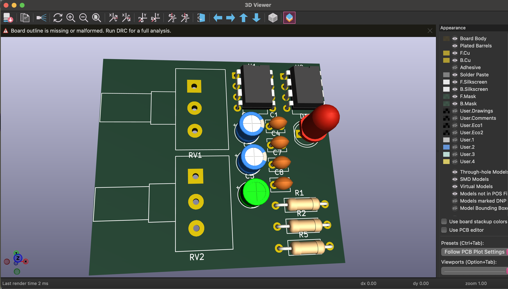

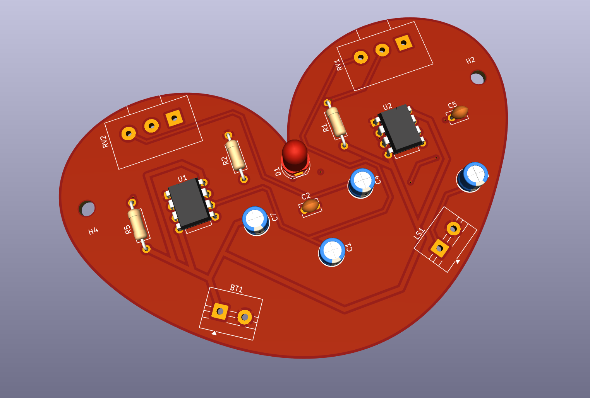

--- 

## encargo-09a

### esquemáticos y PCB en KiCad

cada estudiante debe tomar 2 de las 4 secciones distintas del sintetizador realizado en el proyecto 1, y crear un proyecto en KiCad por cada una, que contenga tanto el esquemático y la PCB de cada sección.

anotar cada paso en la bitácora, incluyendo mayores aprendizajes y dificultades encontradas, además de problemas y dudas que quieran que abordemos en la próxima clase.

### Paso 01: Abrir nuestro esquemático desde el kicad.pro
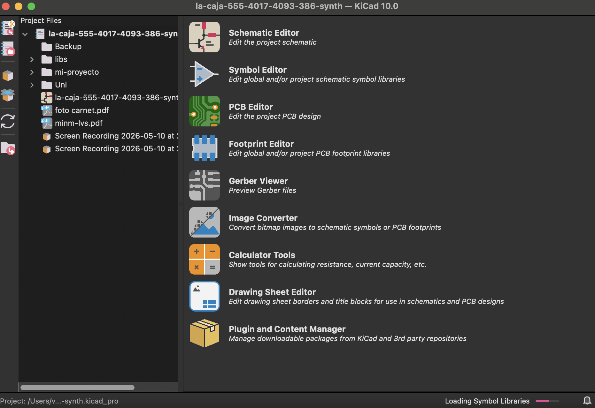
### Paso 02: Yo hice el esquemático del proyecto 1 en kicad así que ya lo tenía armado completo
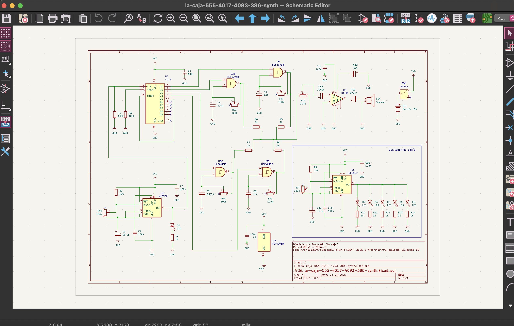
### Paso 03: había que asignar huellas a los componentes
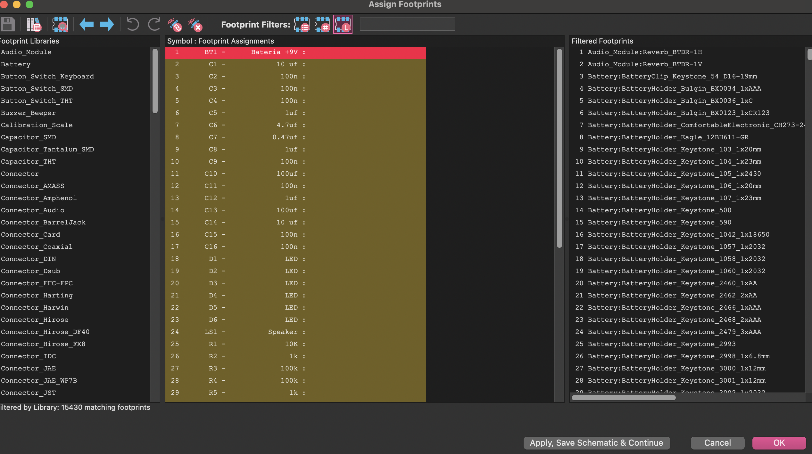
### Paso 04: Copie y pegue las huellas que usamos en la placa que hicismoe  clase y las que no estaban las busque en internet
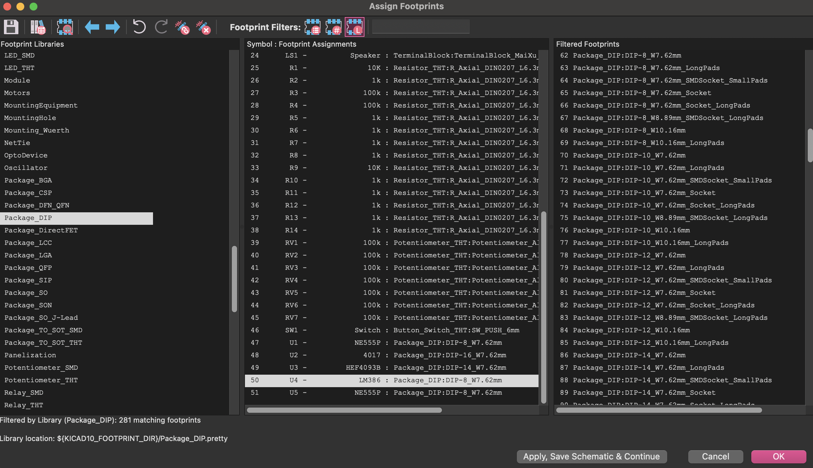
### Paso 05: Me meti al archivo.pcb y cargue los componentes, 0 errores, slay
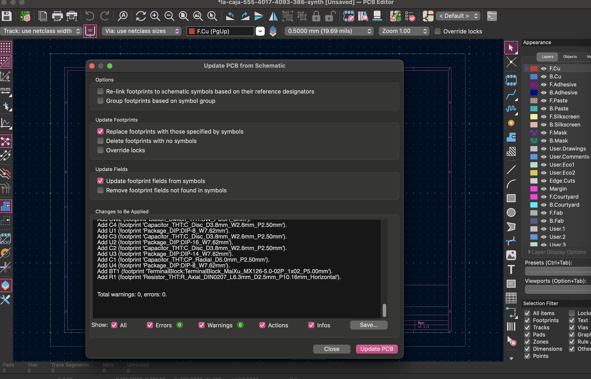
### Paso 06: Mis componentes ahí en el aire, les hice un contorno y comencé a ordenarlos
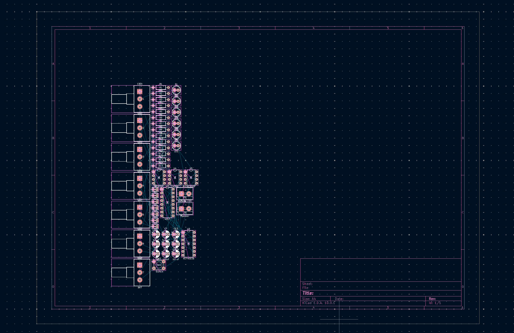
### Paso 07: Ya irdenados y en vista 3D, me complica aún saber bien en dodne me conviene más poner cada uno, será un talento adquirido.
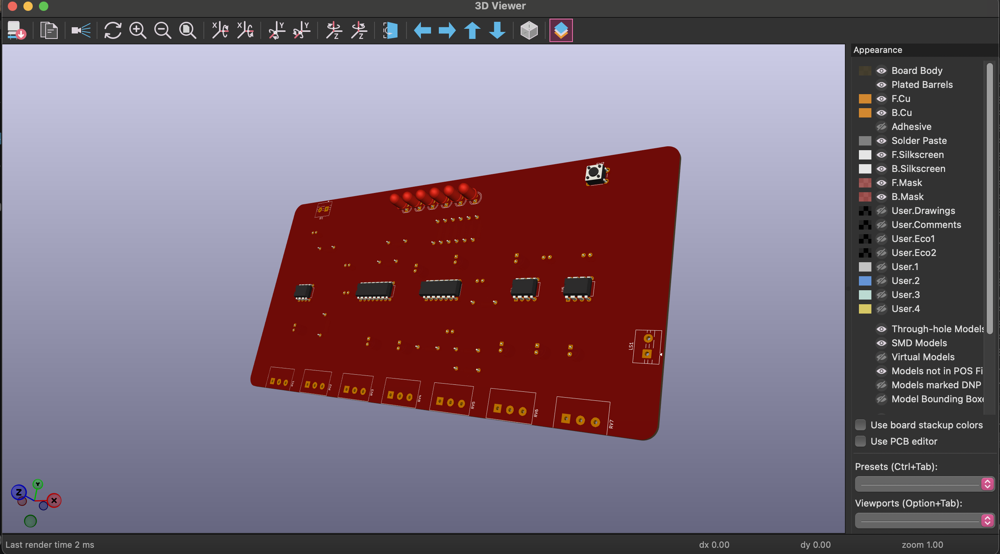
### Paso 08: Ahora habia que poner los canales
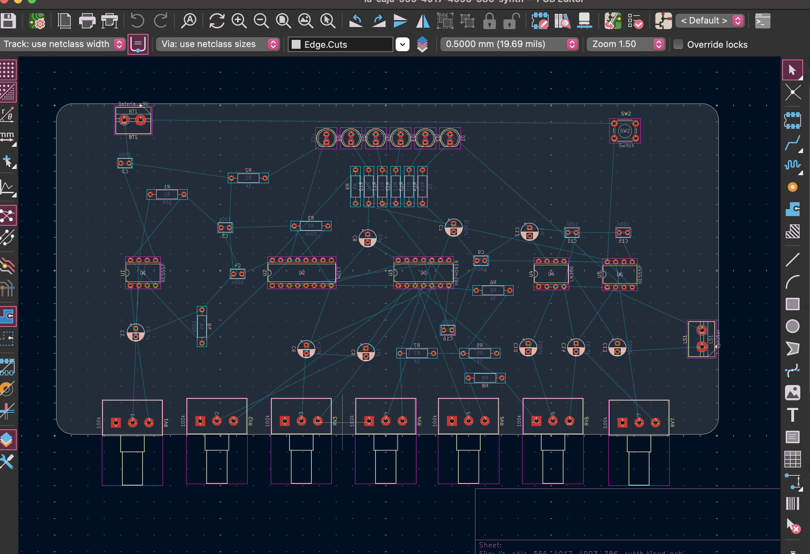
### Paso 09: todo listo, complicaciones en los canales, habia una isla, no super arreglarlo, pero pretty.
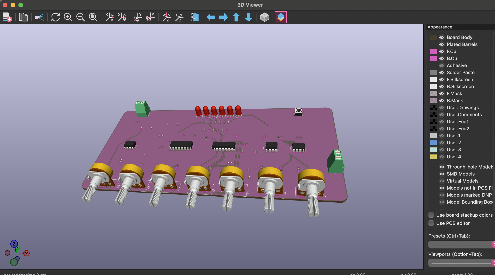
### Paso 10: Es rosada y tiene los modelos 3D, slay
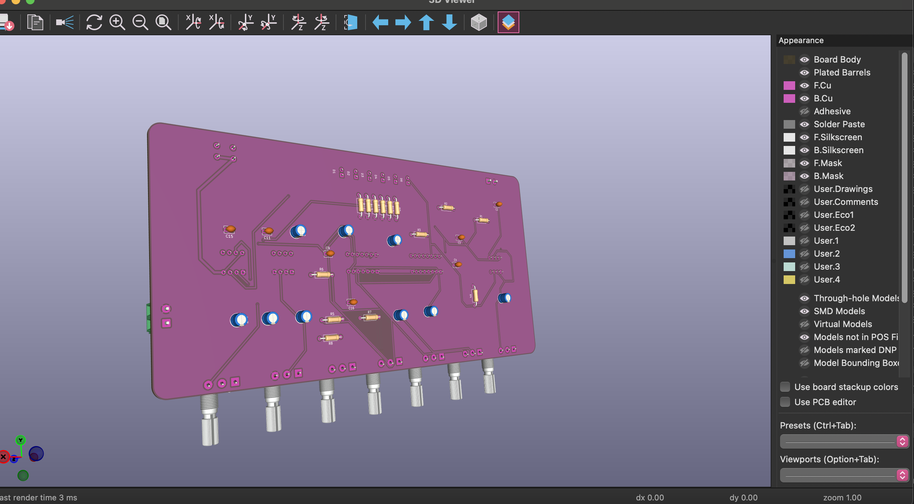

---

### lectura de libro de Flusser, capítulo 1

leer introducción y capítulo 1 del libro Hacia una filosofía de la fotografía, de Vilém Flusser, disponible en <https://monoskop.org/images/8/8d/Flusser_Vilem_Hacia_una_filosofia_de_la_fotografia.pdf>

compartir apuntes y reflexiones críticas sobre el texto, prohibido usar inteligencia artificial, no sirve para este ejercicio.

## Apuntes de lectura

Flusser parte de una hipótesis: la civilización humana ha tenido dos momentos de cambio radical, el primero fue la invención de la escritura lineal y el segundo es el que estamos viviendo ahora: la invención de las **imágenes técnicas** (fotografía, cine, video, etc.), parte de la cultura que la llama Tecnografía.

Lo que me pareció interesante es que no pretende probar una tesis, por lo miso el dice que no cita fuentes de información, sino que busca abrir una discusión, el libro funciona más como preguntas que como respuestas.

### Capítulo 1: La imagen

Las imágenes son **superficies significativas**, así lo llama en la primera línea del cap. No son ventanas al mundo, sino abstracciones, toman algo de cuatro dimensiones y lo reducen a dos dimensiones. A esa capacidad de abstraer y volver a proyectar, Flusser la llama **imaginación**, que dice que las imágenes se manifiestan a través del observador.

Esto quiere decir que el significado de una imagen no está fijo, cuando la miramos, nuestros ojos se mueven por la superficie en un proceso que él llama **registro** (*scanning*), ese recorriido es una mezcla entre lo que la imagen propone y lo que nosotros traemos como observadores. Por eso las imágenes son **connotativas**, no denotativas, que siempre están abiertas a interpretación. (tuve que investigar que era denotativo y connotativo).

Eso me pareció súper interesante, he visto algunos videos en los que hacen eso con la gente, como escanear donde se va su vista al ver algo. Flusser dice que las imágenes tienen una lógica de **tiempo circular**, que la mirada puede volver una y otra vez sobre los mismos elementos, y cada vez que vuelve, los resignifica, eso es distinto al tiempo lineal de los textos, donde hay un antes y un después.

A ese tiempo circular él lo llama **magia** <3, en las imágenes todo se relaciona con todi, no hay causa y efecto sino contexto y significado, por eso dice que las imágenes tienen significado mágico.

Además Flusser plantea que las imágenes nacieron para mediar entre el hombre y el mundo, para hacer el mundo imaginable, pero en algún punto esa mediación se invirtió, o sea el hombre dejó de usar las imágenes para entender el mundo y empezó a **vivir en función de las imágenes**, onda ya no las descifra, sino que las proyecta directamente sobre la realidad, y a eso lo llama **idolatría**.

Luego los textos nacieron para explicar las imágenes, pero las imágenes ilustran los textos para hacerlos imaginables, o ses se necesitan mutuamente, y a lo largo de la historia: los textos se volvieron más imaginativos y las imágenes se volvieron más conceptuales.

Hasta que en el siglo XIX la textolatría alcanzó un grado crítico, los textos ya no eran imaginables para nadie y eso según Flusser, fue **el fin de la historia**, y justo ahí fue cuando se inventó la fotografía, para hacer los textos nuevamente imagineables y para colmarlos de magia (nuevamente).

Me pregunto que pasa ahora, en donde la fotografía volvió a ser esta "proyección" de la realidad, sobretodo con las redes sociales, creo que es un circulo sin fin.

