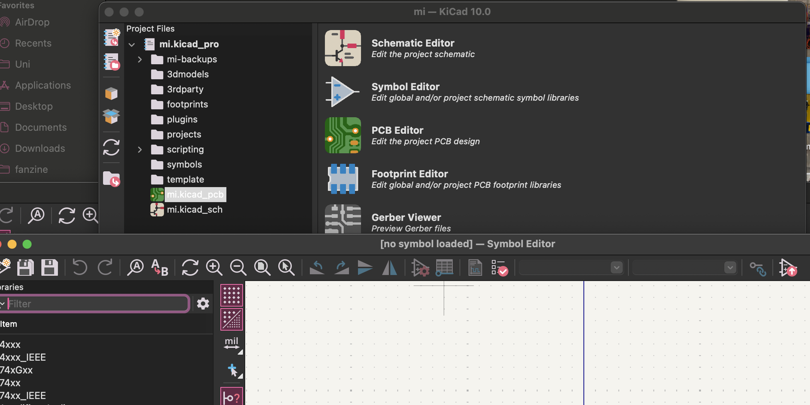
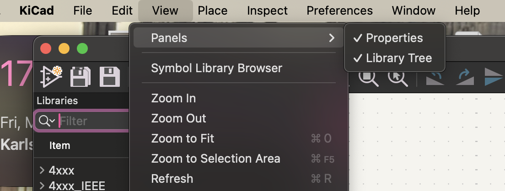
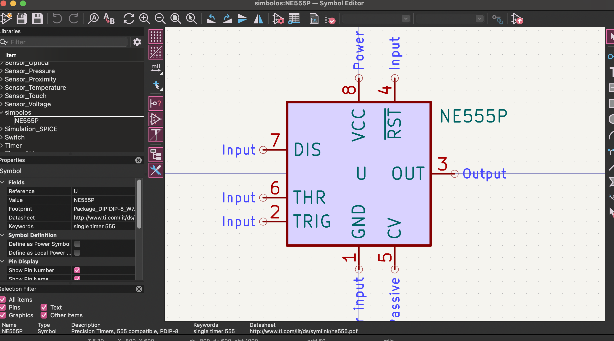
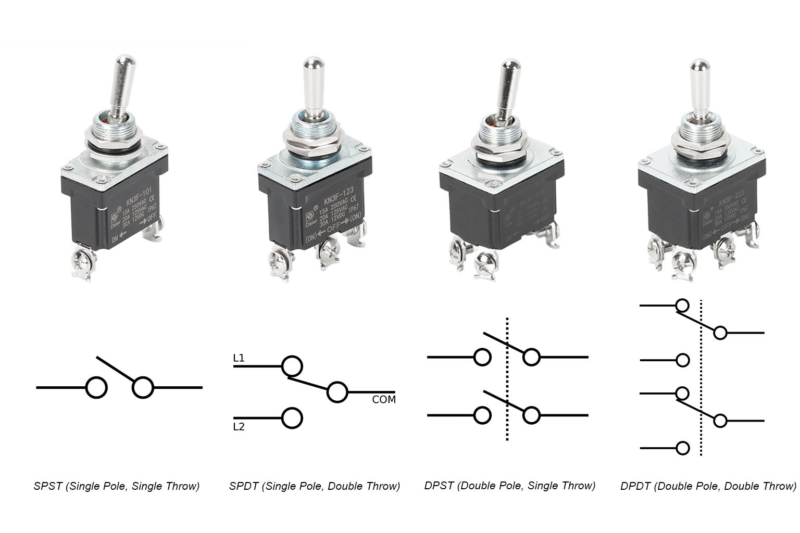
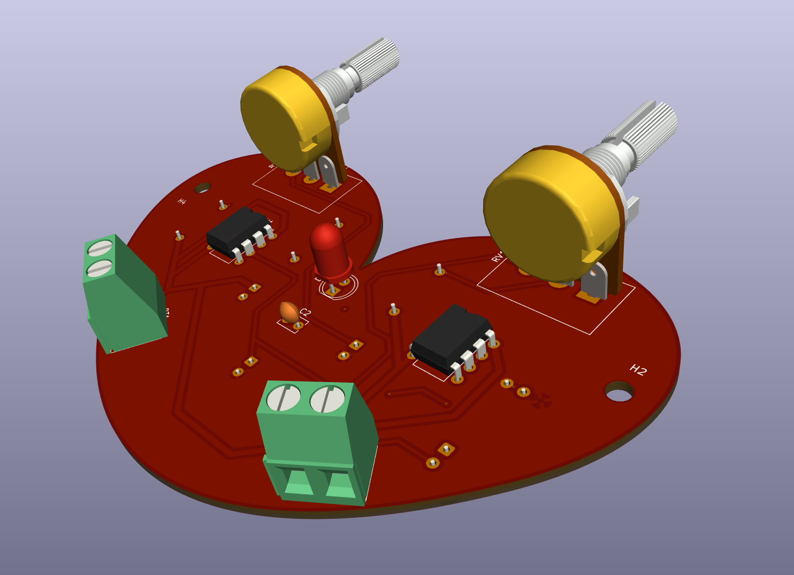

# sesion-09b 15.05

## Símbolos
Para modificar/personalizar nuestros símbolos, lo seleccionamos, apretamos la "e" y seleccionamos "edit symbol" para editar sus propiedades específicas.

Si queremos nuestra propia biblioteca de símbolos, primero debemos crear una carpeta en donde deben estar guardadas, para eso primero nos vamos a "Symbol Editor" en nuestra carpeta con extensión ".pro"

luego en el panel de arriba nos vamos a view/panels/library tree

Con las bibliotecas activadas nos vamos a file/new library para crear nuestra carpeta que deberá aparecer una vez guardada en la lista de libraries, así que voy al componente que quiero personalizar, lo copio y lo pego en el nombre de mi carpeta, lo edito y guardo.

[`Las imágenes nos confunden de la realidad, ¿quién soy yo?, limitan nuestra imaginación.`]

### Botones:
**temporales**
  * pulsadores
  * timbres
  * pushbuttons
  * no-abierto
  * nc-conectado

**Interruptores**
  * palanca
  * switch

> Para encontrar el interruptor, buscamos SW_SPST o ST_SPDT y le ponemos la huella [Button_Switch_THT:SW_PUSH_6mm]

### Etiquetas
Conectar sin cableado en el esquemático

* Para activarlo ocupamos la "L" de Label.

La podemos usar para evitar el error de pin no conectado a la salida, debemos conectar desde la bateria la etiqueta "PWG_FLAG".

### Cambiar de cara los componentes

Selecciono el componente y apreto "F"

### Modelados 3d
Seleccionas la huella del componente en el .pcb, presionar "e", ir a 3d models, ahí cargar los que se tengan descargados.

Para descargar la placa completa con los modelos 3D, vamos a archivos, exportar y seleccionamos el de STEP/STL, etc.

---

## Lectura, Cap 2 y 3

Acá Flusser comienza a hablar de la **imagen técnica** (las producidas por un aparato) y cómo son distintas a la imagen tradicional. Las imágenes tradicionales las llama pre-históricas y anteceden a los textos, mientras que las técnicas las llama pos-históricas y surgieron de ellos.

También las distingue en su nivel de abstracción, las tradicionales son abstracciones de primer grado (abstraídas del mundo concreto), las técnicas son de tercer grado (abstraídas de textos, que a su vez son abstraídos de imágenes, que son abstraídas del mundo), o sea, son imágenes de imágenes de imágenes.

Flusser explica que las imágenes tradicionales significan fenómenos y las técnicas significan conceptos, interesante, las imágenes técnicas no necesitan ser descifradas, x ejemplo, una huella digital, porque existen en el mismo nivel de realidad que su significado, entonces pasa que el observador no las ve como imágenes, sino como una verdad, una ventana al mundo, y Flusser dice que confiamos en ellas como confiamos en nuestros propios ojos, eso es lo peligroso, la objetividad de las imágenes técnicas es una ilusión, igual que cualquier imagen, son simbólicas, abstracciones.

Para él, el concepto de "aparato" no es simplemente una herramienta, las herramientas prolongan los órganos del cuerpo (un martillo prolonga el puño, una flecha prolonga el dedo), pero los aparatos no transforman el mundo, sino que transforman el **significado** del mundo <3 El fotógrafo no extrae ni transforma objetos, sino que produce, procesa y distribuye símbolos, por eso Flusser lo llama **homo ludens** en vez de homo faber, no es un trabajador, es un jugador.

O sea, el fotógrafo es un jugador y la cámara es el juguete, que tiene un programa interno que define todo lo que puede fotografiarse y todo lo que no, que brigido como habla de la cámara como algo tan poderoso, y que el fotógrafo cree que elige libremente, pero en realidad está explorando las virtualidades que el programa de la cámara ya tiene inscritas.......... (increíble) Flusser lo compara con jugar ajedrez, lo más loco es que el programa de la cámara está a su vez programado por la industria fotográfica, que está programada por el complejo industrial, y así sucesivamente, una caja negra dentro de otra caja negra.

Creo que lo que Flusser dice en estos capítulos es súper interesante, onda cuando sacas una foto con el celular, el modo retrato ya "sabe" cómo debe verse un retrato, el modo noche ya "sabe" cómo debe verse la oscuridad(?, yo decido cuándo y dónde apretar, pero mi cámara decide qué es fotografiable(? y cómo...
