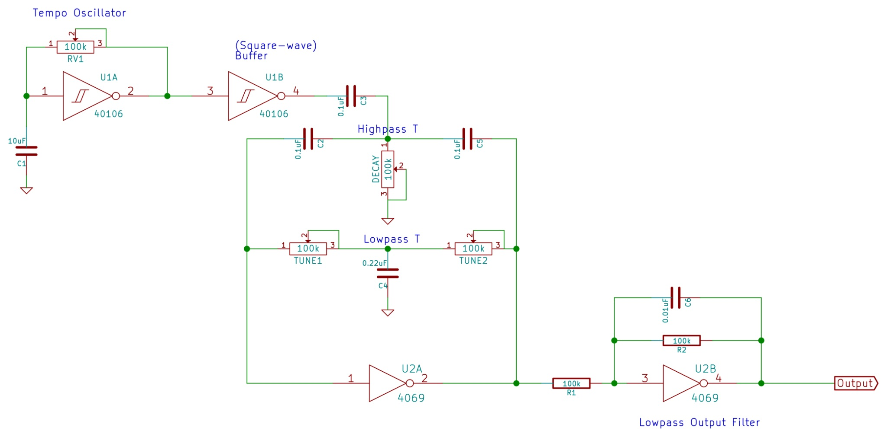
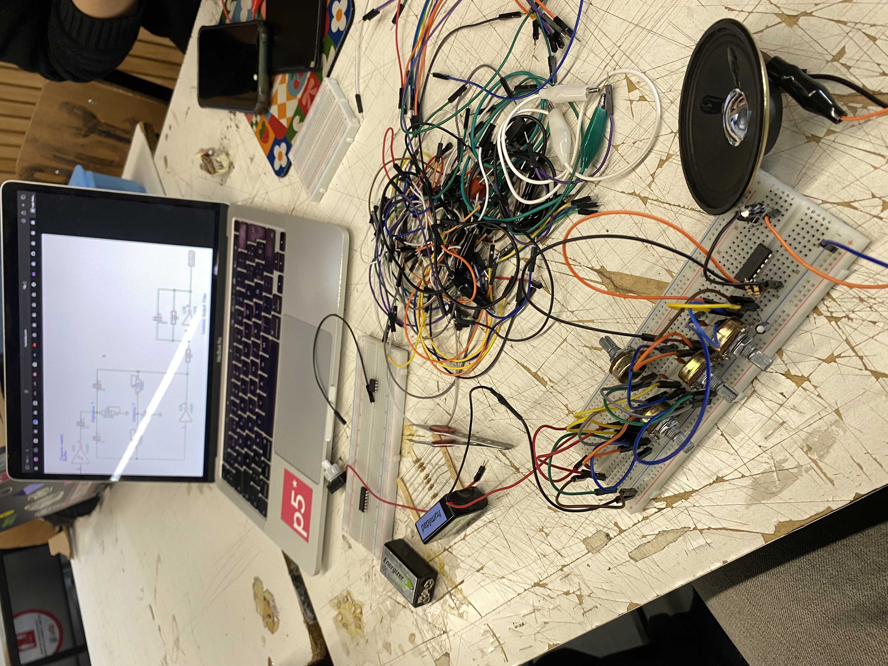

# sesion-10b

22 de mayo 2026

---

Con mi grupo somos los percutores.

Como es un tema desconocido para todos nosotros tuvimos que investigar harto.

Grupo: 
- Catalina Catalán
- Martina Echavarría
- Nicolas Miranda
- Vania Paredes
- Carla Pino 

#### Ayuda profes:

- Moritz Klein
- circuitos que componen TR-808

# Investigación — Percutores / Drum Generators

## Videos de referencia

---

## TikToks de referencia

- <https://vt.tiktok.com/ZSxryK6Nq/>

- <https://vt.tiktok.com/ZSxrypMUP/>
  
- <https://vt.tiktok.com/ZSxrypMUP/>
  
- <https://vt.tiktok.com/ZSxryK6Nq/>
  
---

## Artículos y circuitos

- [Generadores de Percusión — INCB](https://www.incb.com.mx/index.php/articulos/9-articulos-tecnicos-y-proyectos/9910-generadores-de-percusion-art858s)

- [Generador de Percusión para Ritmos Musicales — Newton C. Braga](https://newtoncbraga.com.mx/articulos/9-articulos-tecnicos-y-proyectos/31055-generador-de-percusion-para-ritmos-musicales-art1596s)

- [Twin-T Drum Oscillator with 555 Trigger — CircuitLab](https://www.circuitlab.com/circuit/eykayh/twin-t-drum-osc-with-555-trigger/)

- [Logic Noise: Filters and Drums — Hackaday](https://hackaday.com/2015/03/25/logic-noise-filters-and-drums/)

---

## Links adicionales

- [YouTube Short Reference](https://youtu.be/yz37Yz315eU?si=Ucyh2NPyEpxHKxPC)

- [External Reference Link](https://tinyurl.com/24pvf46l)

1. Máquinas y referentes

- Roland TR-808 
- Ronald TR-909
- Simmons SDS-V
- 555 Drum Synth
- Twin-T Drum Synth

## DIY Twin-T Kick Drum Eurorack Module Demo

Inspirado en la batería de Kassutronics.  
Diseñado como un módulo de bombo utilizando un TL074 con distorsión y filtro.

### Video demo

### Esquemático

---

# Referencias — Moritz Klein

## Sobre Moritz Klein

- Enseña arquitectura modular y síntesis analógica.
- Tiene contenido enfocado en diseño de módulos DIY, percusión y circuitos para eurorack.
- Referente importante para entender drum synthesis y circuit bending orientado a modular.

- ---

El que más nos gustó fue este:

- [Logic Noise: Filters and Drums — Hackaday](https://hackaday.com/2015/03/25/logic-noise-filters-and-drums/)

Así que intentamos recrear este esquemático:

Pero había un detalle sobre este, nos gusta mucho por como suena, y usa un chip 40106BE y un 4069UBE, pero no tenemos un chip 4069UBE, tenemos un BE, misa nos dijo que esto era importante.

La diferencia importante entre estos dos es que el BE es unbuffered (sin buffer interno), mientras que el UBE normalmente es la versión buffered estándar.

Según reddit:

- El 4069UBE tiene una transición más gradual entre HIGH y LOW.
  
Eso permite usarlo en:
- osciladores
- filtros tipo Wasp
- distorsiones
- circuitos analógicos raros
- síntesis DIY eurorack

El 4069BE buffered está pensado más para lógica digital pura:
- señales cuadradas limpias
- switching
- compuertas
- electrónica digital tradicional

Pero por mientras en esta clase no teniamos el UBE, probamos armarlo con el BE

No sono nada, según yo es porque lo armé mal, igual habia poco tiempo, estoy segura que conecté algo nal, pero bueno, aprendizaje ;)
