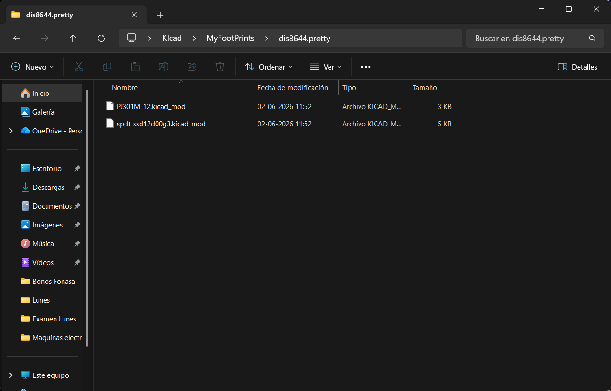
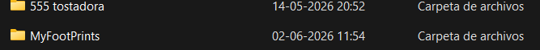
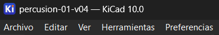
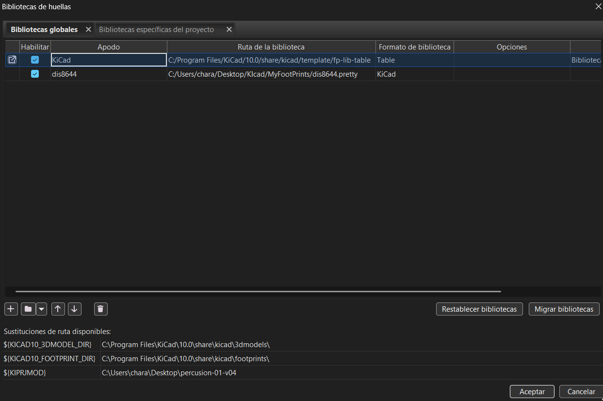
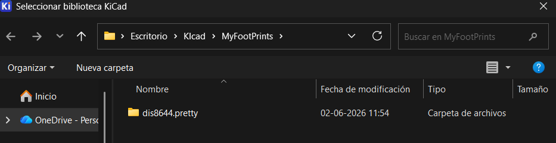
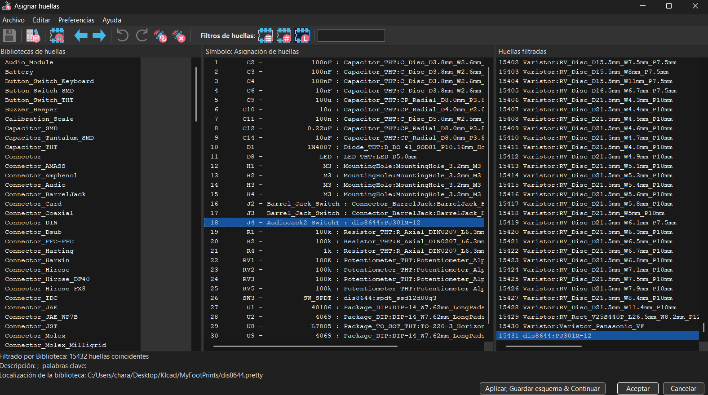
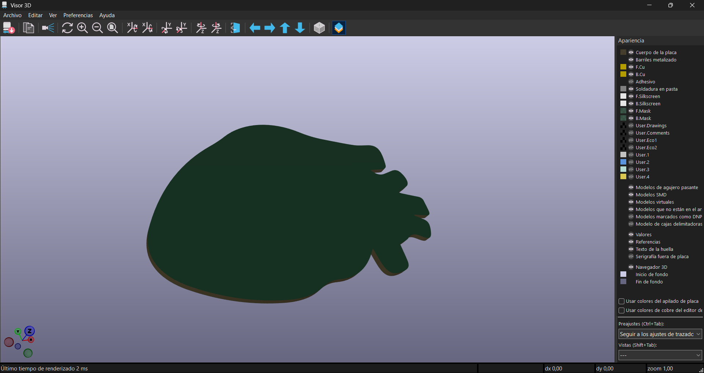
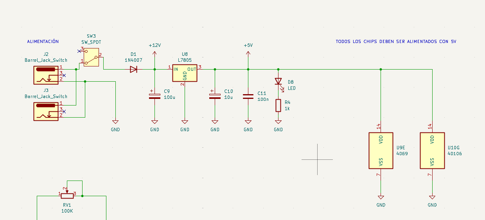
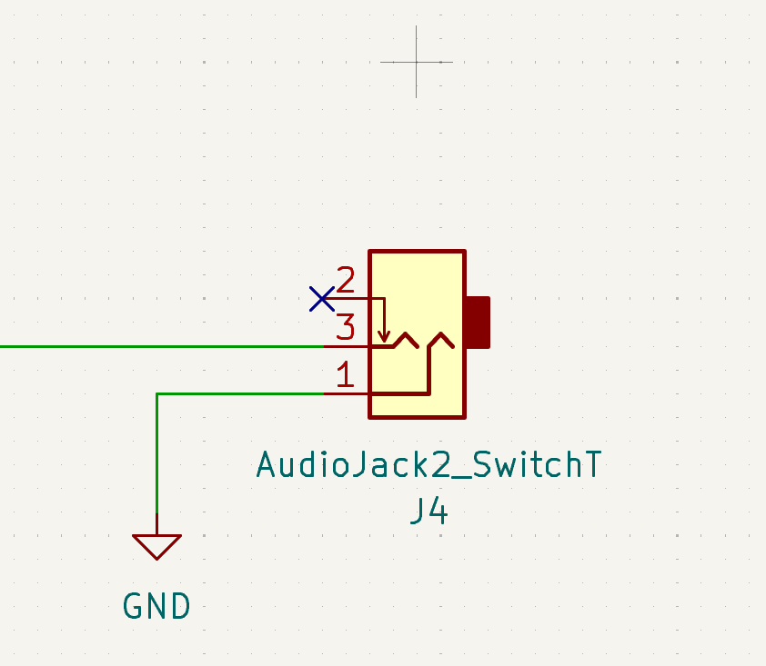
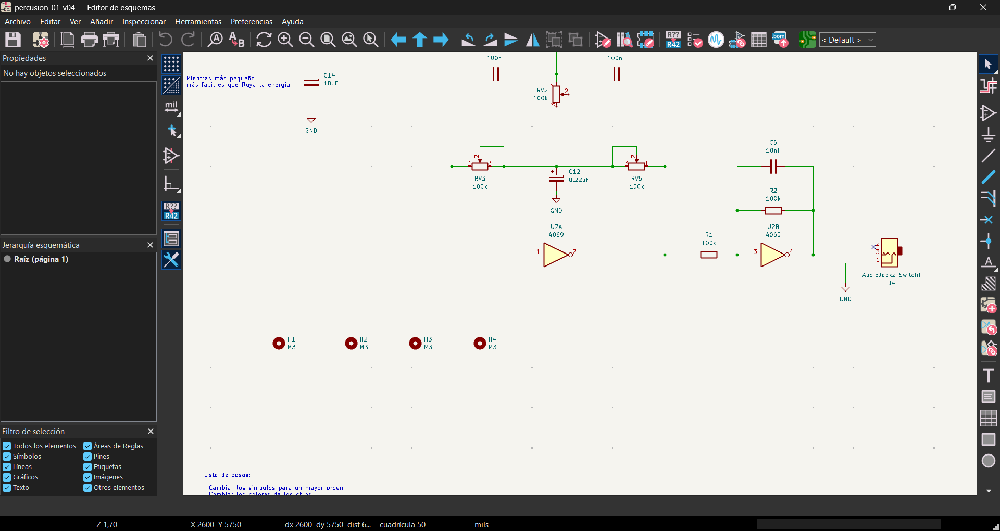

# sesion-12a

Ya es nuestra ultima clase antes de la solemne! ( ; ω ; ) 

El tiempo vuela mi people pero ese tiempo no se puede perder.

---

## Proceso

Finalmente puse toooooooooooooooodas las huellas de manera correcta! 

| Componente  | Valor            | Huella                                                         |
|-------------|------------------|----------------------------------------------------------------|
| Condensador | 100u             | Capacitor_THT:CP_Radial_D8.0mm_P3.80mm                         |
| Condensador | 10u              | Capacitor_THT:CP_Radial_D4.0mm_P2.00mm                         |
| Condensador | 100n             | Capacitor_THT:C_Disc_D5.0mm_W2.5mm_P2.50mm                     |
| Diodo       | 1n4007           | Diode_THT:D_DO-41_SOD81_P10.16mm_Horizontal                    |
| LED         |                  | LED_THT:LED_D5.0mm                                             |
| Conector    | DC               | Connector_BarrelJack:BarrelJack_Horizontal                     |
| Conector    | Audio            | dis8644:PJ301M-12                                              |
| Conector    |     Alimentaci´n | Connector_PinSocket_2.54mm:PinSocket_1x03_P2.54mm_Vertical     |
| Resistor    | 1k               | Resistor_THT:R_Axial_DIN0207_L6.3mm_D2.5mm_P10.16mm_Horizontal |
| Switch      | spdt             | dis8644:spdt_ssd12d00g3                                        |
| Regulador   | L7805            | Package_TO_SOT_THT:TO-220-3_Horizontal_TabDown                 |

Cabe aclarar que esta es la tabla final que se nos dio a todes

---

Entonces ¿algo más?

Pues una que otra huella tuvimos que ponerlas de otra biblioteca ¿Pero como?

## ¿Como instalamos otras carpetas en nuestro KiCad? ♡ (・`ω´・)/ ♡

- Paso 1: Instalamos los archivos y los metemos en una carpeta con el nombre específico dis8644.pretty.

  
- Paso 2: Esa carpeta la metemos en una carpeta que almacenará todas nuestras bibliotecas, como: "MyFootPrints" (al menos de una manera ordenada)

  
- Paso 3: Abrimos KiCad y nos vamos al apartado de preferencias

  
- Paso 4: Abajo de la ventana deberíamos ver un icono de carpeta pequeño y buscamos entre nuestras carpetas la de dis8644.pretty (dándole doble clic en el proceso)

  
- Paso 5: Aceptamos y nos vamos a nuestro esquemático

  
- Paso 6: Para verificar, nos vamos a la lista de huellas y, si anteriormente fueron asignadas, entonces no saldrá ningún error

y TADA! 

*Nadie lee estas cosas pero bueno, si alguien me esta sapeando espero le haya servido :3)*

---

Ya con eso visto, falta la PCB 

Para este trabajo le di el relevo a la Vania porque soy media lentita con eso. PERO HICE LA FORMA DEL CORAZÓN

Dejé una carpeta en donde se pueden ver todos los intentos y en general hay varias cosas para aclarar:

- El formato si o si debe ser en **svg** y no en otro (nuestros 2 primeros intentos fueron en dxf y no funciona)

- Aunque en illus (nuestro caso) se haga el grafico en una medida especifica, al momento de pasarlo a la placa, es muy probable que sea más pequeña

- Se puede aumentar si al momento de importarla se agranda la escala de a poco

- Al momento de hacer un grafico para que sea la forma de la placa, la figura debe estar rellena de "negro" y debe estar bien cerrada o el programa tirará mil errores

Y así se verá al final!:

## Con los cambios en el esquematico para finalizar:

Se colocó la alimentación:

Se añadió la salida/Jack

Y los MountingHoles!

---

### Y SE ACABO!

fue un proceso largo, pero se ha conseguido!

Mañana debería ver si las huellas están bien puestas porque las especificaciones se subieron un poco después y no sé si sean las mismas... Si no lo son, seguramente me asesinen ( ╥ω╥ )

Nota: Creo que estan bien...solo estoy loca 〣( ºΔº )〣

