# sesion-08a

## KiCad ##

***Este programa ya fue definido y explicado en sesiones anteriores***

### Primeros pasos ###

Este software posee similitud de trabajo con otros que manejan diversos archivos simultaneos, tales como Adobe Premier Pro y Autodesk Inventor. Es decir que se trabaja en torno a un _proyecto_, en el cual se enlazan diferentes archivos, en este caso los esquemáticos por ejemplo

 

1. Lo primero es dirigirse a la esquina superior izquierda en la ventana _Archivo_

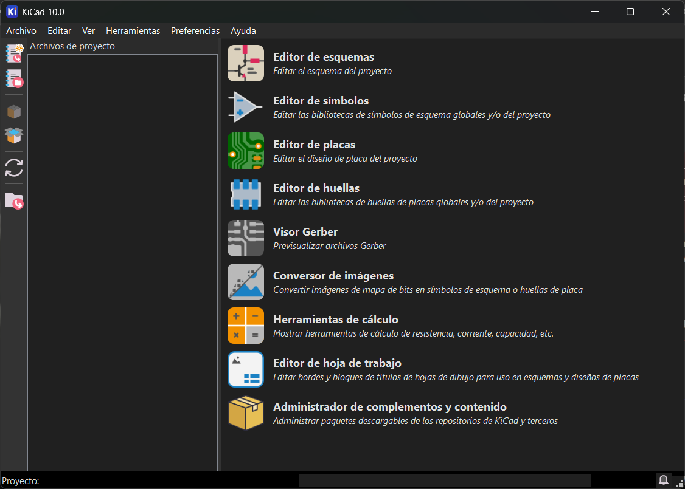

 

2. Luego elegir la primera opción _Nuevo Proyecto..._

> Existe la posibilidad de utilizar el comando Ctrl + N

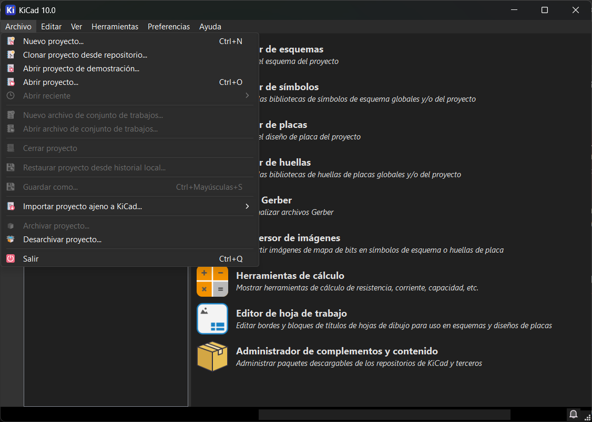

 

3. Elegimos la configuración _default_

> Existen diversas plantillas, como las de Arduino 👁️

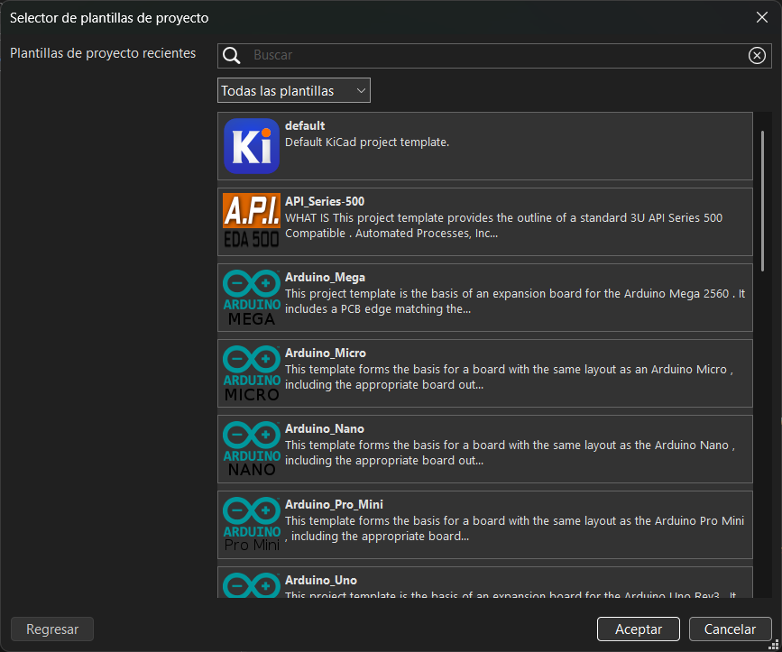

 

4. Seleccionamos la ubicación de nuestro _Proyecto_ (el _""enlace""_ con los demás archivos que generemos)

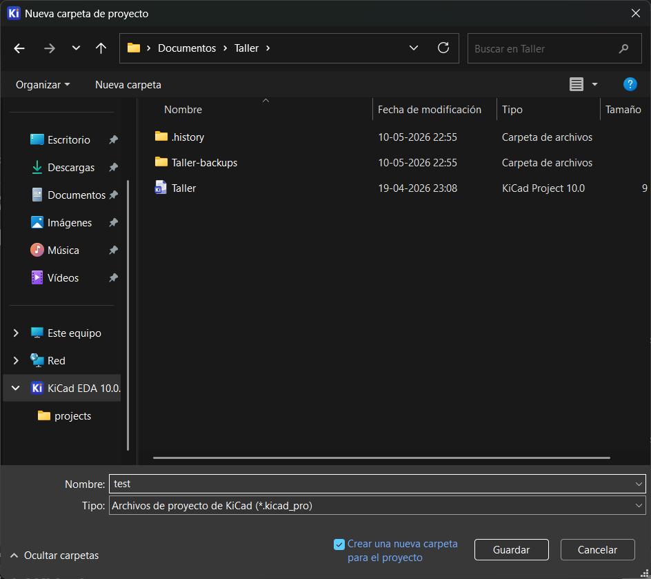

 

5. Tenemos listos nuestros archivos para empezar a trabajar

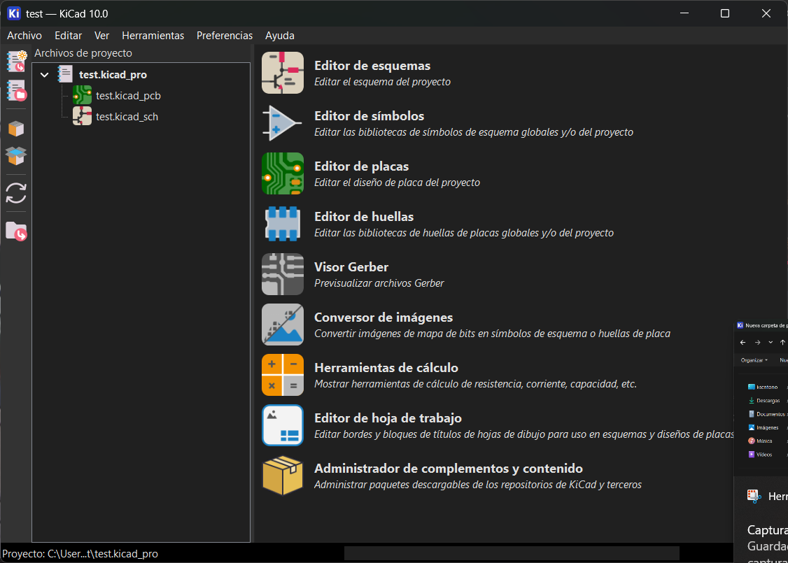

>Es importante entender la terminación de cada archivo, es decir, el texto despues del punto
>
>> | Extensión de archivo | Significado |
>> | -------------------- | ----------- |
>> | .kicad_pro           | Proyecto    |
>> | .kicad_sch           | Esquemático |
>> | .kicad_ pcb          | PCB         |

 

---

### PCB ###

Se enumerarán los pasos 1 a 1 para realizar y configurar una PCB en KiCad

 

#### Paso 1:  Dibujar esquematicos ####

 

- Abrimos el archivo _.kicad_sch_

-  Con la 3ra opción de la barra de tareas derecha iniciamos colocando los componentes

> También se puede utilizar el atajo de teclado _A_

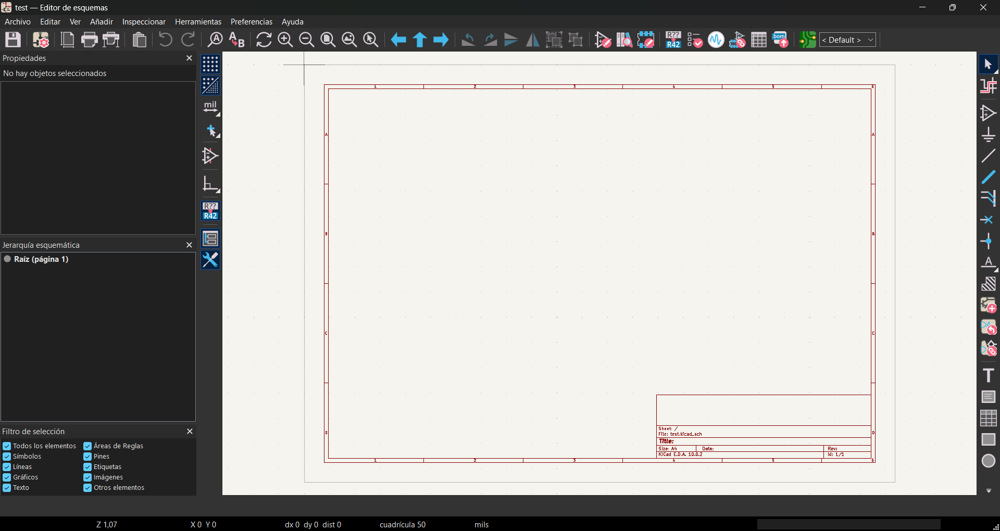

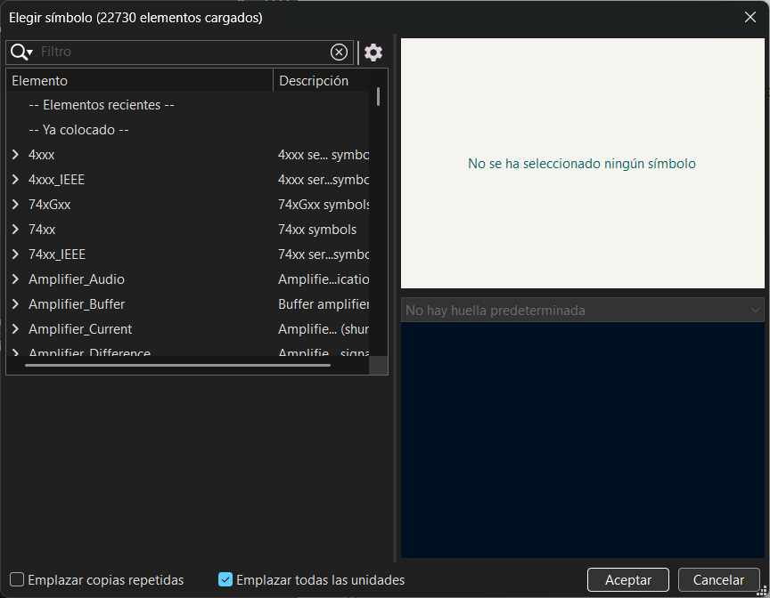

 

- Una vez tenemos todos los componentes a mano los conectamos

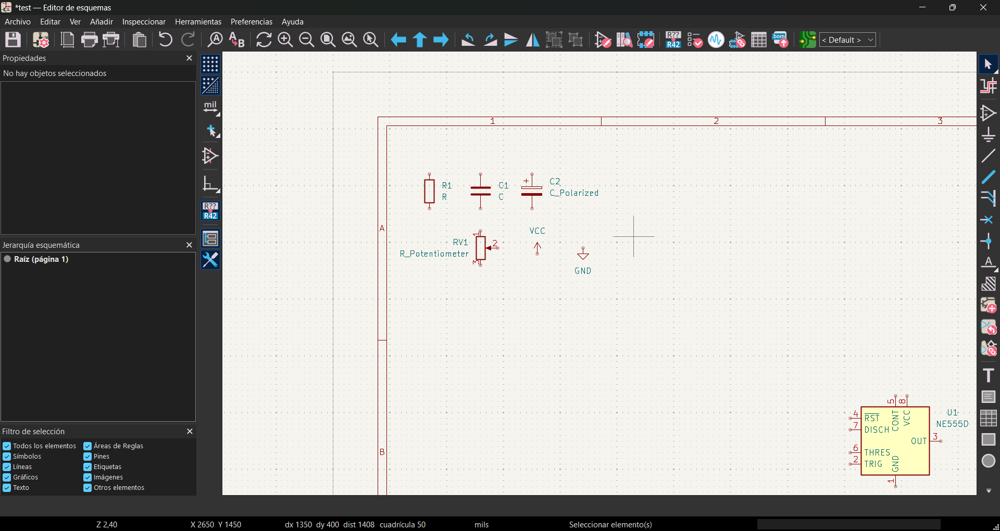

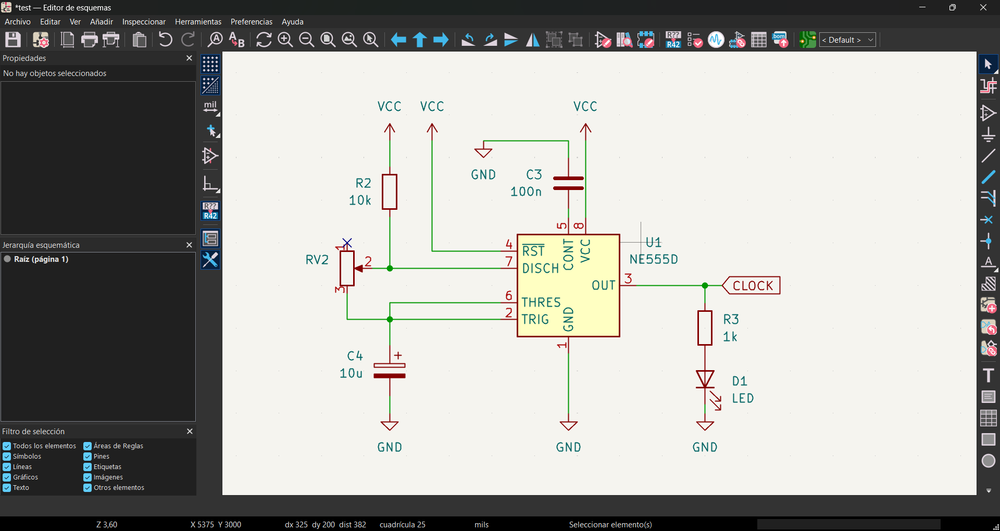

> Debemos hacer doble _click_ en cada componente para asignarles un valor
>
> > Es importante mantener la misma nomenclatura
> >
> > > Estos valores son referenciales y solo para que alguien los pueda leer, al momento de configurar nuestra PCB no se verá afectada por estos

 

#### Paso 2: Asociar Huellas a Símbolos ####

> Huella: Representación del espacio físico de cada componente en la PCB
>
> Símbolo: Representación conceptual de un componente (específicamente en un esquemático)

- Seleccionamos la opción que se muestra en la imagen inferior

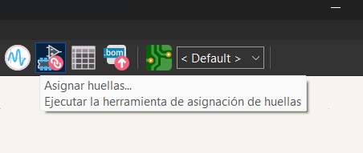

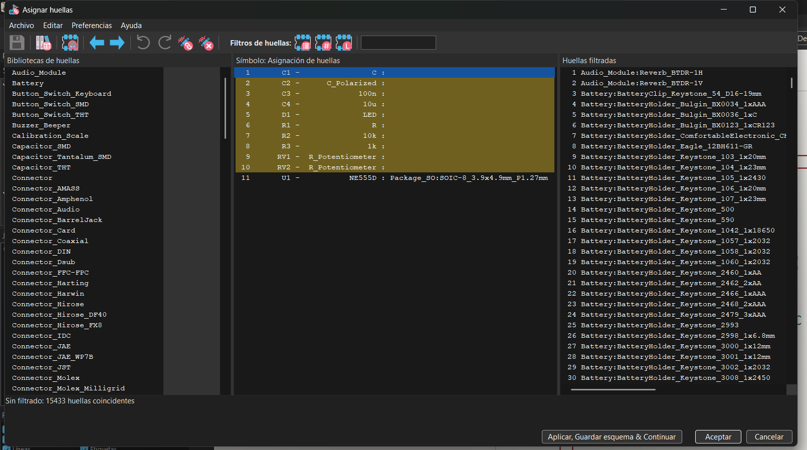

 

- Ahora se debe asociar cada Símbolo a un tipo de Huella, esto se define según el tamaño del componente y el tipo, es decir, THT y SMT

> Se definio anteriormente ambos conceptos

| Componente              | Huella                                                         |
| ----------------------- | -------------------------------------------------------------- |
| Capacitor cerámico      | Capacitor_THT:C_Disc_D3.8mm_W2.6mm_P2.50mm                     |
| Capacitor electrolítico | Capacitor_THT:CP_Radial_D5.0mm_P2.50mm                         |
| Resistencia             | Resistor_THT:R_Axial_DIN0207_L6.3mm_D2.5mm_P10.16mm_Horizontal |
| Potenciómetro           | Potentiometer_THT:Potentiometer_Alps_RK163_Single_Horizontal   |
| Led                     | LED_THT:LED_D5.0mm                                             |

> Huellas utilizadas en clase

 

#### Paso 3: Abrir PCB New ####

- Seleccionar ícono expuesto abajo

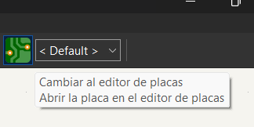

 

- Una vez en la interfaz de PCB seleccionar el símbolo expuesto abajo

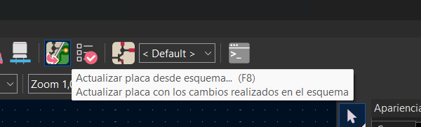

 

-  Le damos a aceptar y salimos de la ventena emergente, clickeamos donde queremos dejar los componentes

> Podemos visualizar desde ya como se vería la placa
>
>>  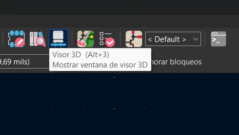
>>
>> 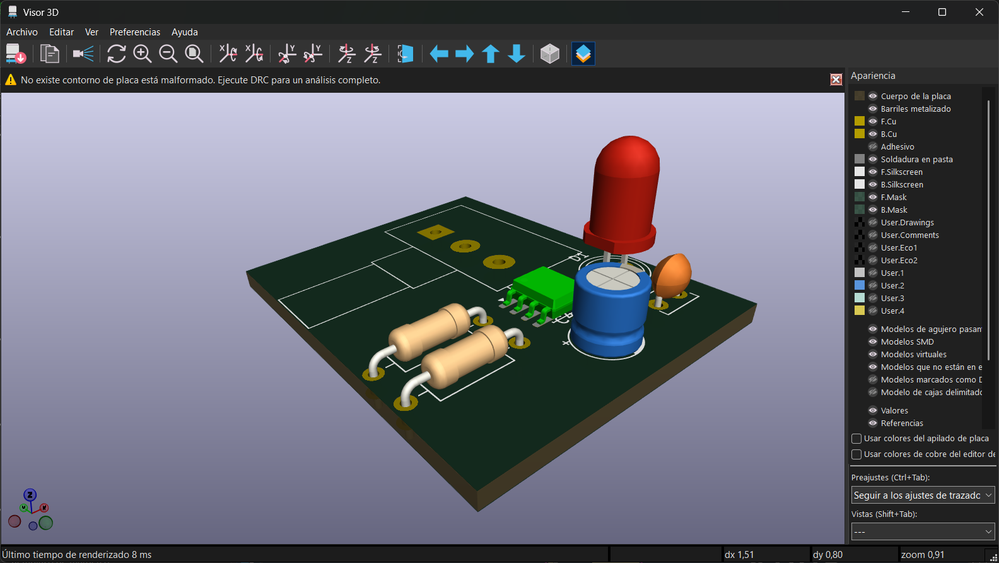

 

---

***IMPORTANTE: Solo trabajamos los 3 primeros puntos del proceso***

---

#### Paso 4: Definir tamaño de pistas ####

#### Paso 5: Repartir Componentes ####

#### Paso 6: Rutear Componentes ####

#### Paso 7: Exportar ####
