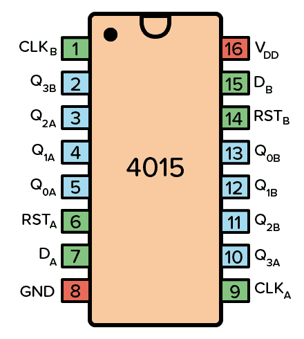
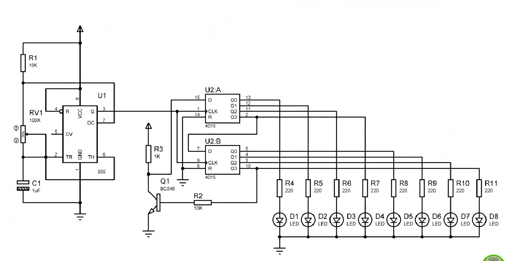
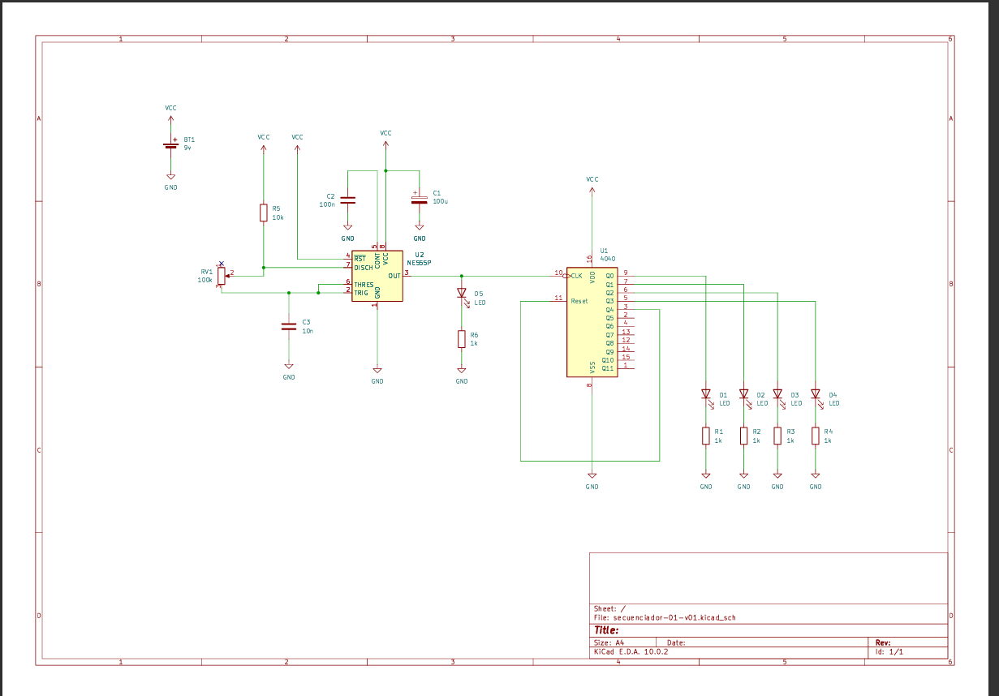
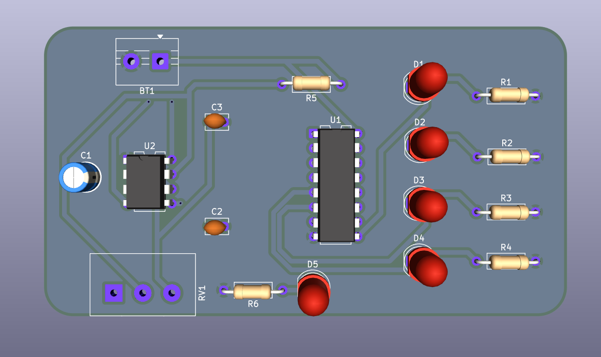
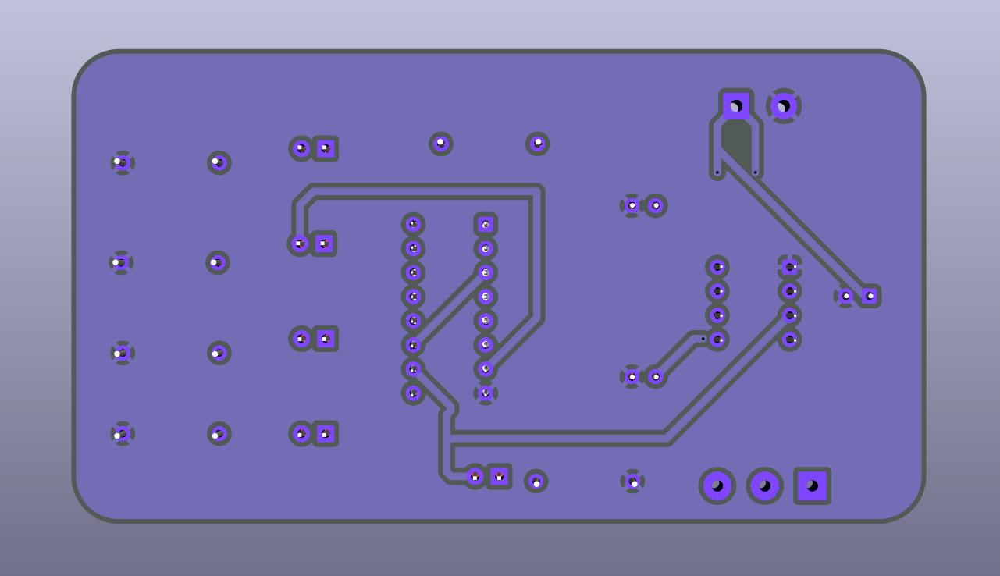

# sesion-11a

## Trabajo en clase

En esta sesión se enfocó en trabajar en la 2da opción de secuenciador

Quedó definido que el chip central del segundo circuito sería el **4017**

 

Este IC es un "_shift registers_":

Por lo que entendí, es un tipo de secuenciador que genera un efecto cascada. Es decir, que en vez de ir encendiendo leds uno por uno, se genera una diferencia de tiempo entre que se activa el siguiente y se apaga el anterior.

Un ejemplo de esto es cuando colocamos un cubo de lava en Minecraft y lo sacamos un segundo despues. La lava procede a esparcirse de manera paulatina mientras desaparece

 

 

Luego de investigar encontramos el siguiente esquema para generar este efecto, algo interesante es el hecho de que este chip posee 2 modulos que se interconectan para generar el efecto mencionada. Otro punto es que al igual que otros secuenciadores necesita de un reloj en el input, decidimos usar la vieja confiable, el 555 Astable

---

Me gustaría mencionar que no profundice tanto en este IC, dado que otra parte del grupo se enfocó en investigarlo

---

### Trabajo en casa

Se realizaron esquematicos tanto del secuenciador 01, el cual funciona en base al 4040. Además de entender y tratar de adaptar la fuente de poder que nos adjunto Misa

 

---

Esta semana esta siendo intensa, por lo que la sesion 11b se profundizará y trabajará con mayor ahinco (bonita palabra, me gusta usarla xd)
