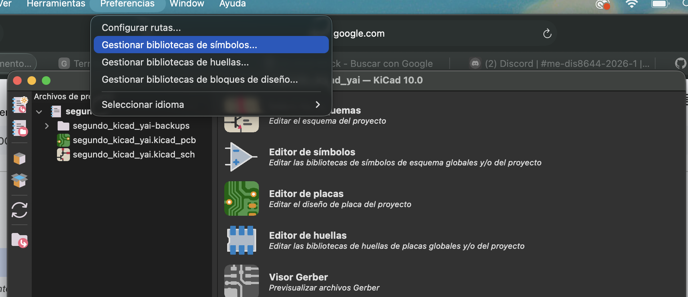

# sesion-09b

## Apuntes – Ajuste de huellas (PCB)

+ Para ajustar la huella de un componente, se puede hacer clic en cada uno y modificar su huella de forma individual, Para que estos cambios se mantengan en la placa, es necesario actualizar la PCB.
+ Al actualizar la placa, se sincronizan y se actualizan todas las huellas. 

    
  
  
### Cómo cambiar las patitas del 555 en el esquemático

+ Existen símbolos que vienen desde las bibliotecas de KiCad, no se deben editar los símbolos originales de la biblioteca, sino que se debe hacer una copia (tipo fork).
  
Para esto:

1.- Ir a Preferencias - bibliotecas de símbolos

2.- Crear una nueva biblioteca (.kicad_sym) donde se guardarán los símbolos editados

  
  
Luego:

3.- Buscar el símbolo del 555 en otra biblioteca

4.-  Copiarlo

5.-  Pegar y guardarlo en la biblioteca propia
  
 En el símbolo editado: Se pueden modificar los pines desde Propiedades del pin.
  
También se pueden mover:

1.-  Seleccionar el pin

2.-  Presionar M (mover)

3.-  Mover el pin 5 de arriba hacia abajo

4.-  En el editor de símbolos también se puede editar gráficamente:

5.-  Presionar E para editar propiedades (color, relleno, etc.)
  
+ Si aparece un asterisco (*), significa que el archivo no está guardado
  

### Botones e interruptores

Existen dos tipos principales:

+ Temporales (push button): funcionan solo mientras se presionan
+ Switch (interruptor): cambia de estado y se mantiene
  
Ejemplo:

+ Push button:  como un timbre
+ Switch:  como prender/apagar una luz

