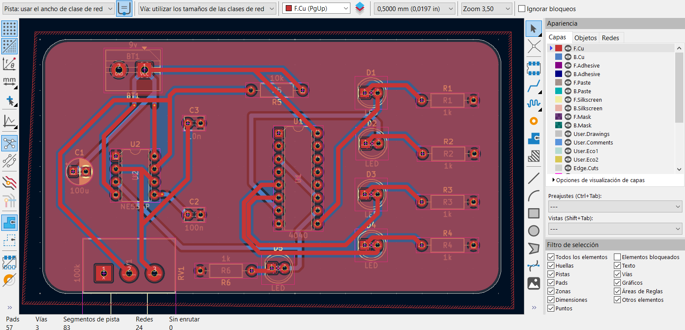
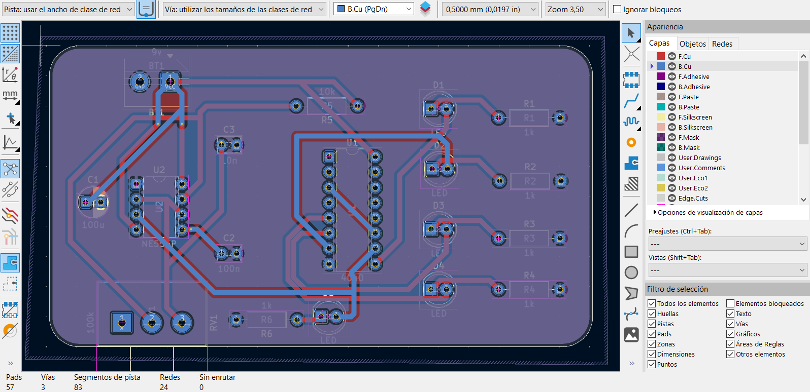
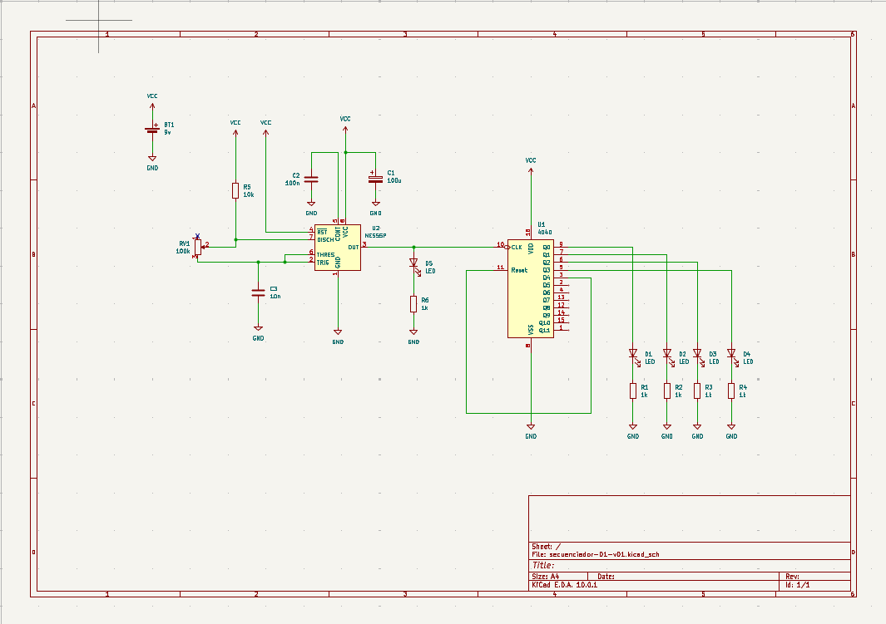

# sesion-10b

22-05-2026

## Apuntes

Avance de proyecto donde realizamos una protoboard con el clock del chip NE555 y el secuenciador con el chip CD4040, además de revisar variantes de los mismos chips.

Con el grupo avanzamos con el esquemático, poniendo las huellas de cada uno en su lugar y, de momento, dejamos para la casa realizar los PCB de la versión 1 del proyecto.

Registramos por partes los textos y fotos mientras se iba avanzando.

Los LED eran los que nos mostraban si estaba funcionando nuestro secuenciador.

También nos dividimos tareas para traer el próximo martes un avance para la segunda versión del proyecto.

Lo eléctrico tiene que ver con cómo funcionan las cosas en lo mínimo.

Si la información está siendo procesada, es electrónico.

**Para los avances en grupo del secuenciador esto fuelo que que notamos como grupo**

| Paso | Proceso |
|------|----------|
| 1 | Partimos viendo las dudas que teníamos sobre el chip 4040. |
| 2 | Empezamos a evaluar si quedarnos con el CD4040 o el CD4017, o si teníamos alguna otra propuesta de chip CD. También nos planteamos la opción de hacer un circuito sin chip. |
| 3 | Se realiza el circuito con el CD555 en el protoboard para empezar a probar los circuitos. Primera falla: pin 6 y 2 no estaban conectados|
| 4 | Se realiza el esquemático en KiCad del CD4040. |
| 5 | Haremos una prueba del CD4040 de 4 pasos. NO ESTABA CONECTADO A GND |
| 6 | Se conecta el CD 555 y CD4040 y el 4040 falla, no prende las led |
| 7 | Logramos que el circuito funcionara el CD4040 oscila correctamente |
| 8 | Prueba del CD4040 integrarles mas leds |
| 9 | Se hizo una prueba con 7 leds, pero el ultimo led no prendia-Hipotesis: Led quemado-Mala conexion de algun cable/ En definitiva estaba quemado el led, se arreglo el problema cambiando el led obviamente |
| 10| Haremos un mix CD386 para probar como suena con el CD4040/ no funciono/Se evalua posibles fallas. -Habia un cable que no estaba conectado a nada  -Se cambio 3 veces de chip y ninguno funciionaba( no sabemos si eran los chips o era por otra cosa) -Se evalua la posibilidad  de que el parlante este bueno|
| 11| Desarmamos el CD4040 y el CD386 para hacerlo denuevo y ver que esta fallando |

### Finalizacion de la clase

Carpeta: Proyecto 02- empezar a escribir nuestro proceso en la carpeta

tenemos que hacer dos alternativas/ modulos- va a ser un ecosistema que se hace cargo de un tema

traer: esquematicos,PCB, Lista de materiales

IMPORTANTE:no subir videos a proyecto 02 si se permite subir Gifs

Subir links de youtube

Subir imagenes

kicad- NO subir carpeta comprimida (ZIP NO SE SUBE)

Nombre del archivo: 3 palabras en minusculas
nombre-alternativa-version(EJ:V.01)

ORGANIZACION GRUPAL
Isidora: Transcribir la informacion a la carpeta del PROYECTO 02, y de la documentacion del proceso

Dayana: Buscar informacion sobre transistores y 2 opcion de chip

Camila: Buscar informacion sobre transistores y 2 opcion de chip

Angel: Se encargara de hacer la PCB en kicad

Tomas: Buscar informacion sobre transistores y 2 opcion de chip

---

Y estas son las tareas que realicé para el grupo

