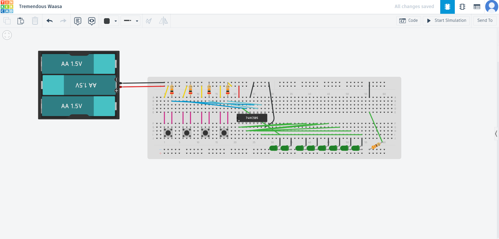

# sesion-11a

26-05-2026

## apuntes

Investigamos y avanzamos por cuenta propia sobre chips y el 4015 fue el que decidimos desarrollar

Por cuenta propia desarrolle una simulacion del chip 74HC595

## Cuales son los parametros del curso

Estamos construllendo un sitema para que se interconecte como tal nuestros proyectos con otros grupos

Sitio web Modulargrid: da un contexto de cuanta gente está trabajando en este rubro

vamos a setear unos parametros para que despues nos podamos mover teniendo en cuenta ese

hay que fijarnos en el seteo y hay que fijarnos en el Barrel Switch

Al audio jack_switch ahy que editarle los nombres por los numeros en 1, 2 y 3 de arriba para abajo

Tamaño de la placa maximo 10 x 10

