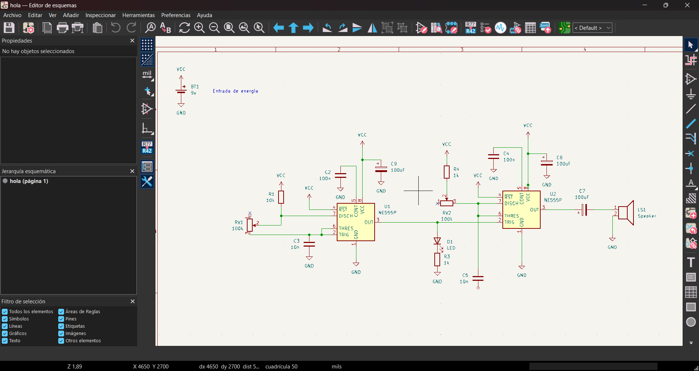
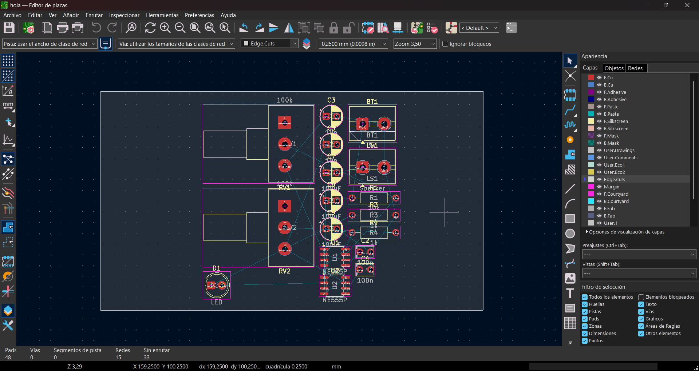
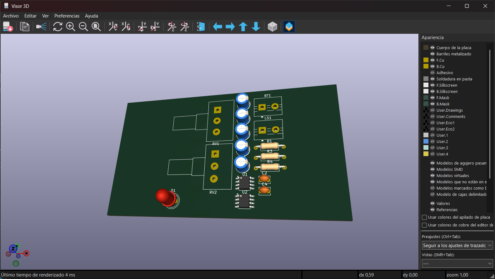

# sesion-08a

# Apuntes 28/04

## KiCad

Para ésta clase nos solicitaron traer nuestros computadores ya que nos enseñarán cómo utilizar KiCad, el cual es un software EDA (Electronic Design Automation, es decir, Automatización del Diseño Electrónico) que nos acompañará durante el resto del semestre para formar esquemáticos y poder diseñar PCB's (Printed Circuit Board, es decir, Placa de Circuito Impreso).

### Instalación de mi primer KiCad

Para iniciar, nos enseñaron cómo instalar KiCad, en lo cual tuvimos que seguir los siguientes pasos:

1. Entrar a la página web de KiCad
2. Entrar en donde nos dice "Download"

3. Seleccionar tu sistema operativo (en mi caso, Windows)
4. Seleccionar la opción de instalar en Sudamérica

Luego de que lo instalemos, tenemos que abrir el programa y KiCad nos dará la bienvenida, para luego seguir los siguientes pasos:

1. _Configuración_: Luego de presionar "siguiente", KiCad nos preguntará sobre la configuración del programa, en donde las personas que no teníamos instalado KiCad teníamos que seleccionar la opción de ``Iniciar con la configuración predeterminada``, mientras que las personas que estén actualizando KiCad a una versión más reciente tenían que seleccionar la opción ``Importar preferencias de una versión anterior en:``.
   
2. _Bibliotecas_: Como en KiCad viene dos softwares (uno para esquemáticos y otro para las pcb), tenemos que tener cuidado en dónde guardamos nuestros "símbolos" (esquemáticos) y en dónde guardamos nuestras "huellas" (pcb), por lo cual lo que **NO** tenemos que hacer es presionar la opción de ``Continuar sin bibliotecas``, sino que tenemos que presionar la opción de ``Start with the built-in KiCad libraries``.
   
3. _Actualizaciones y Privacidad_: En éste caso podemos permitir ambas opciones que se nos muestran, ya que KiCad está en constante actualización. De igual manera, depende de cada uno si desea activar las opciones o no.

## Nuestro primer KiCad

Para que aprendamos a usar Kicad, se nos indicó crear un nuevo proyecto presionando en donde dice ``default`` para luego seleccionar la opción que dice ``_sch``, el cual es el que se encarga del esquemático, mientras que el archivo ``_pcb`` se encarga de ver, como lo menciona en su nombre, el cómo se vería la pcb del mismo esquemático.

Para empezar hicimos el esquemático del Atari Punk, el cual ya conocemos debido a que lo hicimos en nuestras protoboards a inicios de semestre.

Para poder modificar el movimiento dentro del programa, hay que entrar a ``Preferencias (Ctrl+,)`` -> ``Ratón y panel táctil`` -> ``Gestos de desplazamiento``. En ésta parte, cada uno modifica las cosas a su gusto personal.

Ahora, para poder crear algo dentro del archivo ``_sch``, tenemos que aprender las siguientes cosas claves:

+ La tecla ``A`` nos llevará a toda la lista de símbolos, que es en donde encontraremos nuestras resistencias, diodos, chips, etc. Para poder ubicar nuestro símbolo dentro de nuestra hoja técnica, solo hay que hacer click.
+ Para editar la hoja técnica, podemos seleccionar la opción de ``Preferencias de la hoja`` o podemos hacer doble click dentro del mismo lugar y podremos cambiar el tamaño de la hoja, modificar su título, revisión, etc.
+ Para cambiar el valor a los símbolos, hay que hacer click y presionar la tecla ``V`` para poder asignarle su valor a cada componente.
+ Si presionas la tecla ``M`` luego de presionar un símbolo, lo podremos mover a nuestro gusto.
+ Para replicar un símbolo no es necesario volver a buscarlo en la lista de símbolos, sino que podemos hacer ``Ctrl + C`` y ``Ctrl + V``.
+ Si seleccionas un símbolo y presionas la tecla ``R``, éste rotará.
+ Si seleccionas un símbolo y presionas la tecla ``X``, éste se refleja respecto a su eje "X", y pasará lo mismo con la tecla ``Y`` respecto a su eje "Y".

Luego de aprender todo ésto, nos dieron tiempo para poder completar el esquemático completo del Atari Punk de manera independiente, el cual nos quedó así:

Luego, para poder asociar huellas a los símbolos tenemos que hacer doble click sobre el símbolo lo cual nos mostrará las propiedades de éste. Una vez dentro de las propiedades nos enfocaremos en los libros que aparecen en la sección de ``Huella``, haremos click y nos mostrará una cantidad enorme de bibliotecas de huellas, por lo que aplicaremos los filtros de huella y buscaremos huellas THT que tengan las mismas medidas que los componentes que nosotros usaremos, por lo cual se nos recomendó andar con un pie de metro a mano. Una vez ya le asignemos una huella a cada símbolo, podemos hacer ``Ctrl + C`` y ``Ctrl + V`` para aplicar las mismas huellas a componentes que son lo mismo.

Cuando ya tenemos todas las huellas, vamos a entrar al modo placa en donde al inicio se ve todo oscuro y vacío, pero cuando apretamos la opción ``Actualizar placa desde esquema (F8)`` se nos va a importar todo el esquema y se nos mostrará como una PCB solo si no hay ningún error dentro del esquemático, lo cual se ve así:

Para poder generar un borde a la placa, nos tenemos que ubicar en la capa ``Edge Cuts`` y dibujaremos el límite a nuestro gusto, que en éste caso lo hicimos con el tamaño de una tarjeta de presentación, lo cual quedó así:

