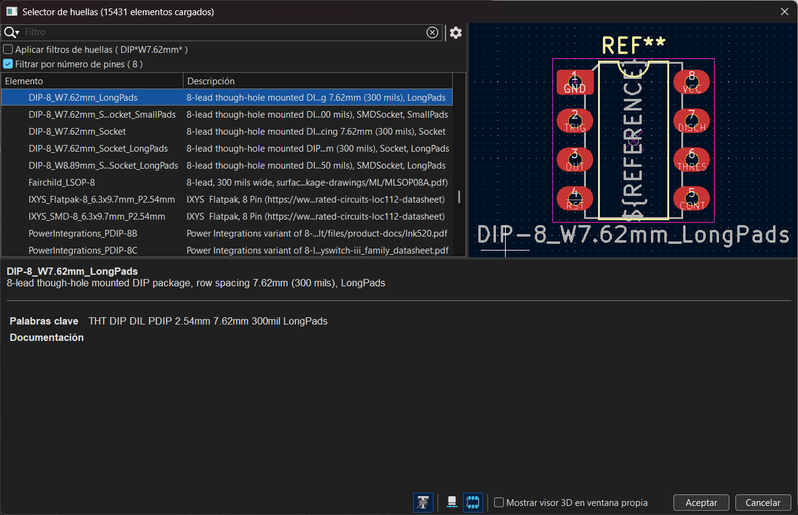
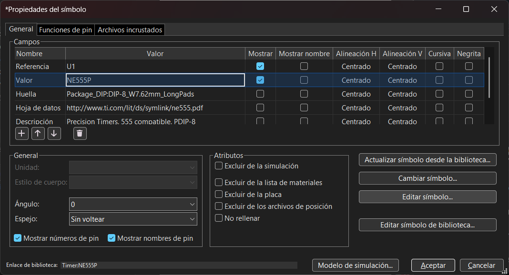
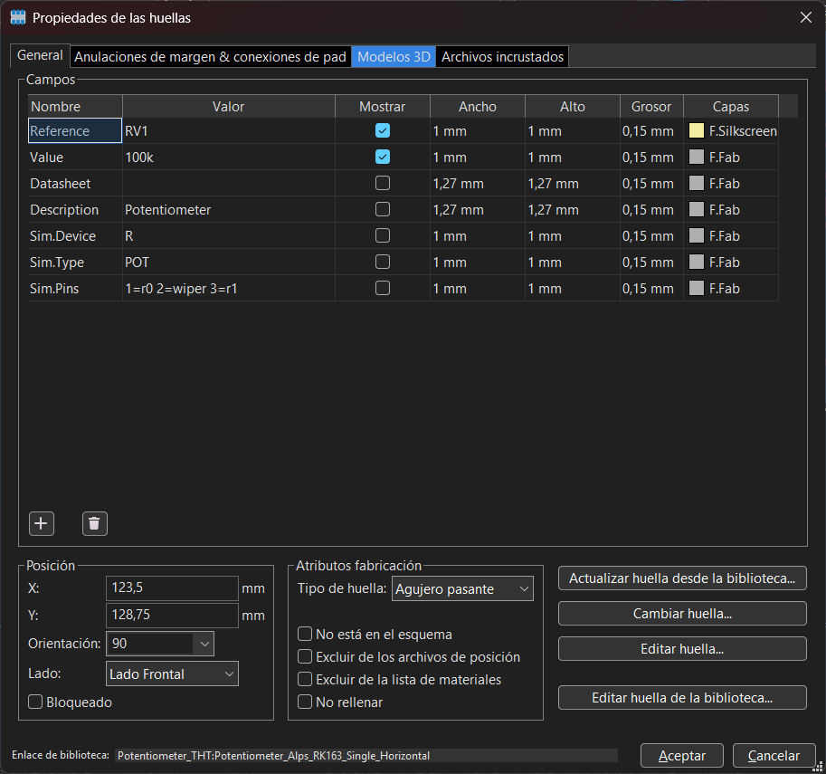
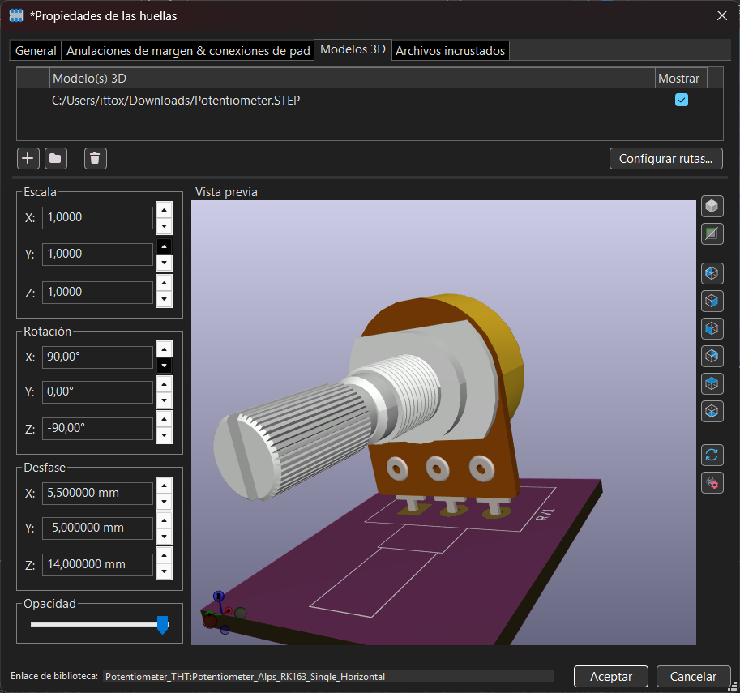

# sesion-09b

# Apuntes clase 15/05

Esta clase se dedicó para resolver todo tipo de dudas que se nos hayan generado en el proceso del encargo anterior el cual fue armar dos PCB dentro de KiCad en base a nuestros sintetizadores. Como se abordaron dudas de todo tipo, esta bitácora será un punteo de cosas que no sabía y me alegro de que se hayan mencionado:

### 1- Huella con tamaño predeterminado para chips

Al momento de asignar huellas, siempre usaremos la siguiente "base" para encontrarlas: ``dip-(cant. de pins) W (ancho) 7.62 - long pads``, el que sea "long pads" no es obligatorio pero es lo ideal ya que esto nos ayudará a que sea más fácil el soldado de la pieza. Aquí un ejemplo de la huella en el símbolo del chip NE555P:

### 2- Cómo editar un símbolo en el esquemático

Esta fue mi duda, ya que en el caso del chip 555 el pin 5 que va directo a GND está en la parte superior del chip, lo cual me molestaba ya que es más simple si todos los pins que van directo a GND se mantienen abajo.

Para poder editar el símbolo, tenemos que seleccionarlo dentro del esquemático y presionar la tecla ``E`` para poder ver las propiedades del símbolo. Una vez nos aparezca la ventana de propiedades, tenemos que seleccionar la opción de ``Editar símbolo`` y **NINGUNA OTRA OPCIÓN!!** ya que podemos dañar archivos de KiCad y llevarnos la pala (quedaría la pura escoba.. perdón).

Una vez ya estemos dentro del editor de símbolos, podemos mover los pines como queramos, añadir más, cambiar el color del símbolo, cambiar los textos, etc. Cuando ya tengamos todo modificado, tenemos que guardar y listo!! 

### 3- Agregar modelos 3D de componentes que no tenga KiCad

Como en el render del modelo 3D de la PCB no se ven los modelos del potenciómetro ni de los terminal blocks, tenemos que añadirlos a mano por lo que Misa envió por discord el archivo ``.step`` de los modelos ya que KiCad funciona principalmente con archivos ``.step``.

Una vez ya tengamos el archivo descargado, tenemos que abrir el visualizador de la pcb (archivo ``.kicad_pcb``), seleccionamos el componente al que le queremos asignar el modelo 3D y apretamos la tecla ``E`` para poder ver las propiedades de este componente. Cuando ya estemos en la ventana de propiedades, tenemos que cambiarnos a la sección llamada ``Modelo 3D`` que se encuentra en la parte superior.

Una vez ya estemos en la sección del modelo 3d podemos ver que nos aparece una opción para cambiar la ruta del modelo del componente, en donde tenemos que hacer click y actualizarlo a la ruta del modelo que acabamos de descargar (en mi caso es el que sale en pantalla).

Cuando ya hayamos agregado la ruta, nos va a aparecer el modelo en el visualizador que tenemos en la ventana. Ahora lo único que queda es encajar el modelo dentro de los espacios que tiene la PCB!! para ésto tenemos que ir modificando las variantes de ``Rotación`` y ``Desfase``.

---

## Capítulo 2 y 3 - Hacia una filosofía de la fotografía, Flusser

Al inicio del segundo capítulo se hace la relación de ``Aparato -> Imagen técnica``, pero a su vez es ``Textos científicos aplicados -> Aparatos``, por lo tanto ``Textos científicos -> Imagen técnica``, pero no entiendo si ésto hace que la imagen técnica sea una versión más distorsionada de lo que son los textos científicos, pero por lo que entiendo así lo considera Flusser, o bueno, no que sea más distorsionada sino que más "abstracta" debido a que éstas son una abstracción de tercer grado debido a que se abstrae del texto, el cual se abstrae de las imagenes tradicionales las cuales se abstraen de lo que fue el mundo en su momento.

Flusser habla de cómo las personas consideran las imagenes técnicas como una visión objetiva del mundo debido a su falta de simbolismo, pero que ésto no es así y que la "objetividad" de la imagen técnica es solamente una ilusión lo cual me hizo quedarme pensando en un momento ya que me di cuenta de que yo siempre he considerado las "imágenes técnicas" como una ventana al mundo tal como lo menciona en el texto, ya que ¿por qué no lo serían? creía que no hay nada entremedio que pueda distorsionar lo que me muestra el aparato que genera la imagen, ya que como menciona después es fácil el ver que las imagenes tradicionales son símbolos ya que el mismo pintor muestra su propia visión de lo que cree que es el mundo, en cambio lo que me hace creer que eso no sucede en el caso de las imagenes técnicas es que lo que genera ahora la imagen es una máquina y no alguien que puede elaborar símbolos en su cabeza, pero claro, todo esto era sin considerar el factor de la caja negra.

Cuando ya entramos en el capítulo tres se nos habla de la relación del humano con las herramientas y las máquinas, en donde se dice (o por lo que entiendo) que las herramientas son una extensión del humano mientras que las máquinas rompieron esa relación con el humano y la invirtieron, en donde nace una frase que me gustó mucho:

> "Antes de la Revolución Industrial, el hombre estaba rodeado de herramientas; después, fue la máquina la que se rodeó de hombres"
